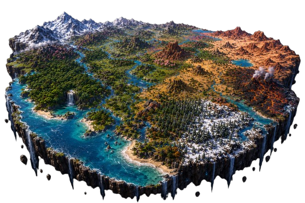

  
  

# worldbench

A single prompt for generating a self-contained Three.js `world.html` of a
floating biome island. Paste it into different models, save each output as
`world.html`, open them in a browser, and compare what you see.

There is no scoring, no schema, no CLI — just the prompt and your own eyes.

The model only ever sees the natural-language prompt. It is never shown
[`outputs/create.html`](outputs/create.html). That file is a hand-tuned
**ideal world** for humans: a qualitative target when judging outputs and
when refining the prompt. Models invent their own scale and layout; a
result can differ or be better if the ecological relationships and climate
logic hold.

## Usage

1. Open [`prompts/prompt.md`](prompts/prompt.md) (see also
   [`prompts/README.md`](prompts/README.md)).
2. Copy the entire file and paste it into a model.
3. Save the raw output (no surrounding prose) as `world.html`.
4. Open it in a browser and look around.
5. Optionally open `outputs/create.html` yourself as a qualitative reference.
6. Repeat with other models and compare the results side by side.
