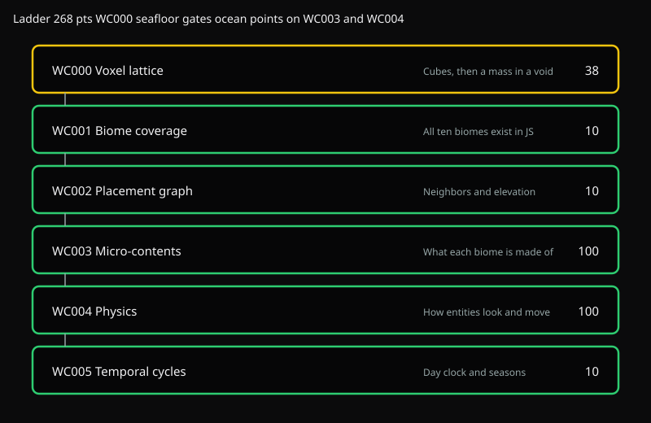
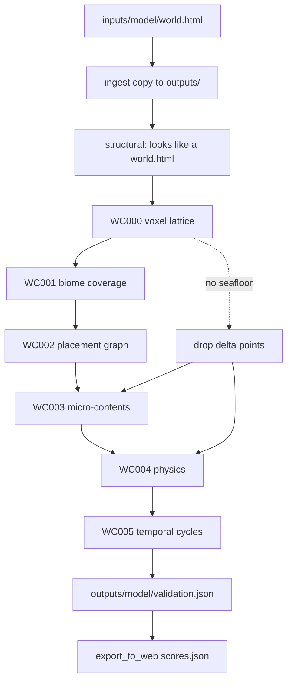

# worldbench

A model gets one natural-language prompt and has to emit a single self-contained Three.js `world.html`: a floating voxel island with ten biomes, water that behaves like water, and a day/year clock. The harness scores that file against a fixed ladder.



## Ladder

| Id | Test | Max | What it asks |
| --- | --- | --- | --- |
| WC000 | [Voxel lattice](tests/WC000_voxel_world/README.md) | 38 | Unit cubes on a grid, then a mass in a void with a seafloor |
| WC001 | [Biome coverage](tests/WC001_trying_all_the_biomes/README.md) | 10 | All ten biomes exist in executable JS |
| WC002 | [Placement graph](tests/WC002_biome_placement/README.md) | 10 | Neighbors and elevation match the wet corridor |
| WC003 | [Micro-contents](tests/WC003_biome_micro_contents/README.md) | 100 | Characteristic stuff in each biome |
| WC004 | [Physics](tests/WC004_biome_rendering/README.md) | 100 | Entities look right and move on the right axis |
| WC005 | [Temporal cycles](tests/WC005_day_night_seasons/README.md) | 10 | Day clock and seasons change the world, not just HUD text |

Total is 268. If WC000 fails `water_bed` or `water_physics`, Coastal Delta / Ocean points are removed from WC003 and WC004. Inland biomes still count.

## Flow


```mermaid
flowchart TD
    src["inputs/model/world.html"]
    src --> ingest["ingest copy to outputs/"]
    ingest --> s["structural: looks like a world.html"]
    s --> w0["WC000 voxel lattice"]
    w0 --> w1["WC001 biome coverage"]
    w1 --> w2["WC002 placement graph"]
    w2 --> w3["WC003 micro-contents"]
    w3 --> w4["WC004 physics"]
    w4 --> w5["WC005 temporal cycles"]
    w0 -.->|no seafloor| gate["drop delta points"]
    gate --> w3
    gate --> w4
    w5 --> val["outputs/model/validation.json"]
    val --> web["export_to_web scores.json"]
```

## Run

```bash
uv run python -m eval.run fable
uv run python -m eval.run fable --test WC000,WC001
uv run python scripts/export_to_web.py --all
```

`eval.run` copies `inputs/<model>/world.html` into `outputs/<model>/`, runs the selected tests (or the full ladder), and writes `validation.json`. Direct `uv run python tests/WC00N/...` skips LangSmith.

WC003 and WC004 each make ten Gemini calls. There is a 20s pause between them on the full ladder.

## Layout

```
inputs/<model>/world.html   # the island under test
outputs/<model>/            # copied world + per-test artifacts (gitignored)
tests/WC00N_*/              # one folder per ladder step
harness/                    # generation: generate (LangGraph generate/debug/fix), model_call, browser_debug
eval/                       # grading: ingest, loader, validate, score, audit, run
scripts/export_to_web.py    # slim scores.json into worldbench-web
```

Regenerate the README diagrams with `uv run python scripts/write_readme_graphs.py`.
