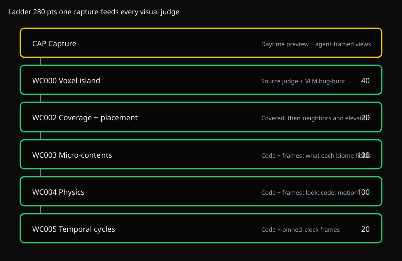
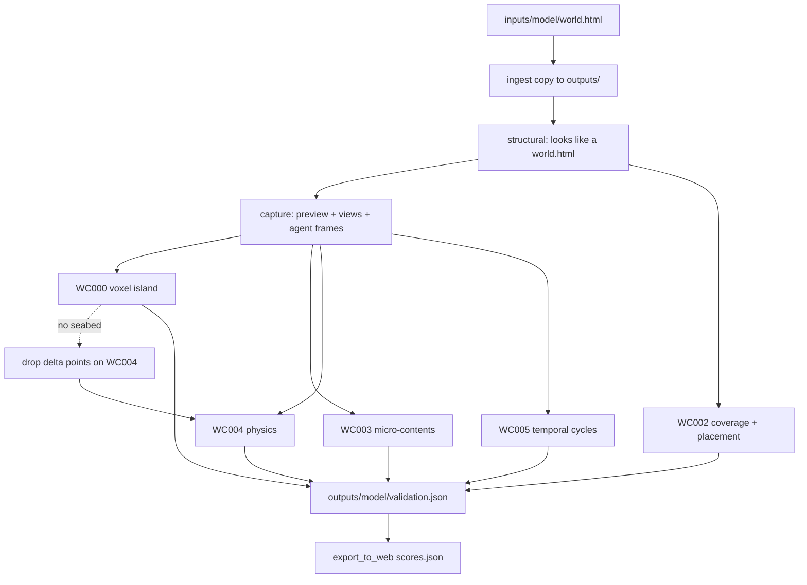

# worldbench

A model gets one natural-language prompt and has to emit a single self-contained Three.js `world.html`: a floating voxel island with ten biomes, water that behaves like water, and a day/year clock. The harness scores that file against a fixed ladder.



## Ladder

| Id | Test | Max | What it asks | Judged by |
| --- | --- | --- | --- | --- |
| WC000 | [Voxel island](tests/WC000_voxel_world/README.md) | 40 | A cube-built island in a void, water on a seabed, no visual defects | LLM on source (20) + VLM on frames (20) |
| WC002 | [Coverage + placement](tests/WC002_biome_placement/Readme.md) | 20 | Each biome is built, then sits by the right neighbors at the right height | LLM on source, deterministic rules |
| WC003 | [Micro-contents](tests/WC003_biome_micro_contents/README.md) | 100 | Characteristic stuff in each biome | Code probe + VLM on the biome's frame |
| WC004 | [Physics](tests/WC004_biome_rendering/README.md) | 100 | Entities look right and move on the right axis | Look: code + VLM. Motion: code |
| WC005 | [Temporal cycles](tests/WC005_day_night_seasons/README.md) | 20 | Day clock and seasons change the world, not just HUD text | Code + frames with the clock pinned |

Total is 280. Every maximum is fixed, so totals compare across models. There is no WC001: biome coverage now lives in WC002.

Two cross-test rules:
- WC003 zeroes the Coastal Delta / Ocean biome when its frames show the ocean running out over the void with no seabed.
- WC004 drops the delta biome's points when WC000 finds no seabed (`water_bed` / `water_physics` below 0.5, or the bug-hunt's `ocean_void`).

## Capture

Every visual judge reads the same frames, captured once per world by `eval/capture/` into `outputs/<model>/capture/`:

1. **Daytime preview.** An LLM patches the world's own clock to obey `?wb_tod=&wb_season=` (guarded: edits may only read `__WB_TIME`, stay small, and match the source exactly once). The brightest of four pinned times is taken as day, so a wrong phase mapping is caught, not trusted.
2. **Fixed views.** Four time-of-day frames, the daytime overview, four orbit directions, and four season frames.
3. **Navigator agent.** One short episode per biome drives headless Chrome through the Chrome DevTools MCP server (legend click, orbit, pan, zoom) and saves a frame of that biome, or gives up with a reason.

`Math.random` is seeded before the page runs, so every reload builds the same island.

## Flow


```mermaid
flowchart TD
    src["inputs/model/world.html"]
    src --> ingest["ingest copy to outputs/"]
    ingest --> s["structural: looks like a world.html"]
    s --> cap["capture: preview + views + agent frames"]
    cap --> w0["WC000 voxel island"]
    s --> w2["WC002 coverage + placement"]
    cap --> w3["WC003 micro-contents"]
    cap --> w4["WC004 physics"]
    cap --> w5["WC005 temporal cycles"]
    w0 -.->|no seabed| gate["drop delta points on WC004"]
    gate --> w4
    w0 --> val["outputs/model/validation.json"]
    w2 --> val
    w3 --> val
    w4 --> val
    w5 --> val
    val --> web["export_to_web scores.json"]
```

## Run

```bash
uv run python -m eval.run fable
uv run python -m eval.run fable --test WC000,WC002
uv run python -m eval.capture.run outputs/fable --force   # recapture only
uv run python scripts/export_to_web.py --all
```

`eval.run` copies `inputs/<model>/world.html` into `outputs/<model>/`, captures views if any selected test needs them (reused while `world.html` is unchanged), runs the tests, and writes `validation.json`. Direct `uv run python tests/WC00N/...` skips LangSmith.

Capture needs Node (`npx chrome-devtools-mcp`). Judges use `CAPTURE_MODEL`, falling back to `WC002_MODEL`.

## Layout

```
inputs/<model>/world.html   # the island under test
outputs/<model>/            # copied world, capture/, per-test artifacts (gitignored)
tests/WC00N_*/              # one folder per ladder step
harness/                    # generation: generate (LangGraph generate/debug/fix), model_call, browser_debug
eval/                       # grading: ingest, capture/, loader, validate, score, audit, evidence, run
scripts/export_to_web.py    # slim scores.json into worldbench-web
```

Regenerate the README diagrams with `uv run python scripts/write_readme_graphs.py`.
