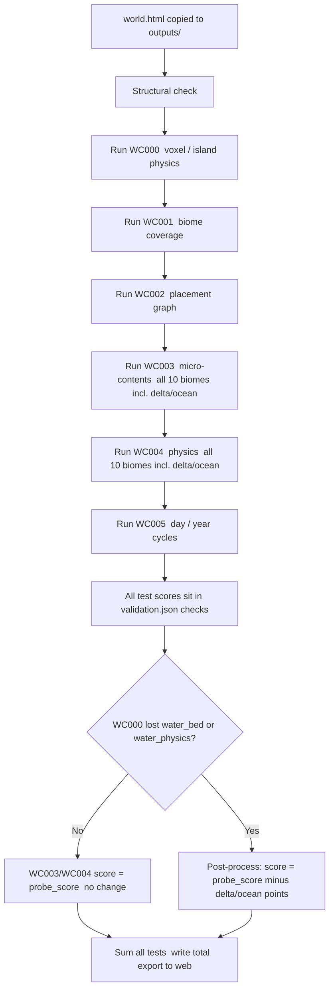

```mermaid
flowchart TD
    A["world.html copied to outputs/"] --> B["Structural check"]
    B --> C["Run WC000  voxel / island physics"]
    C --> D["Run WC001  biome coverage"]
    D --> E["Run WC002  placement graph"]
    E --> F["Run WC003  micro-contents  all 10 biomes incl. delta/ocean"]
    F --> G["Run WC004  physics  all 10 biomes incl. delta/ocean"]
    G --> H["Run WC005  day / year cycles"]

    H --> I["All test scores sit in validation.json checks"]

    I --> J{"WC000 lost water_bed or water_physics?"}
    J -->|No| K["WC003/WC004 score = probe_score  no change"]
    J -->|Yes| L["Post-process: score = probe_score minus delta/ocean points"]

    K --> M["Sum all tests  write total  export to web"]
    L --> M
```