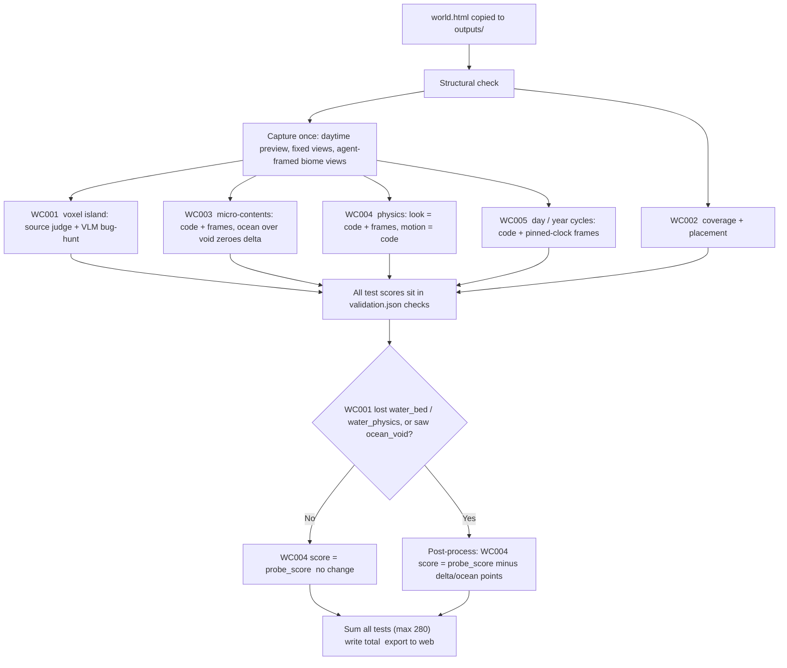

```mermaid
flowchart TD
    A["world.html copied to outputs/"] --> B["Structural check"]
    B --> CAP["Capture once: daytime preview, fixed views, agent-framed biome views"]
    CAP --> C["WC001  voxel island: source judge + VLM bug-hunt"]
    B --> E["WC002  coverage + placement"]
    CAP --> F["WC003  micro-contents: code + frames, ocean over void zeroes delta"]
    CAP --> G["WC004  physics: look = code + frames, motion = code"]
    CAP --> H["WC005  day / year cycles: code + pinned-clock frames"]

    C --> I["All test scores sit in validation.json checks"]
    E --> I
    F --> I
    G --> I
    H --> I

    I --> J{"WC001 lost water_bed / water_physics, or saw ocean_void?"}
    J -->|No| K["WC004 score = probe_score  no change"]
    J -->|Yes| L["Post-process: WC004 score = probe_score minus delta/ocean points"]

    K --> M["Sum all tests (max 280)  write total  export to web"]
    L --> M
```
