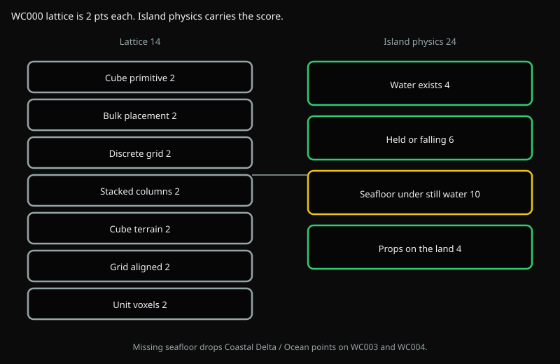
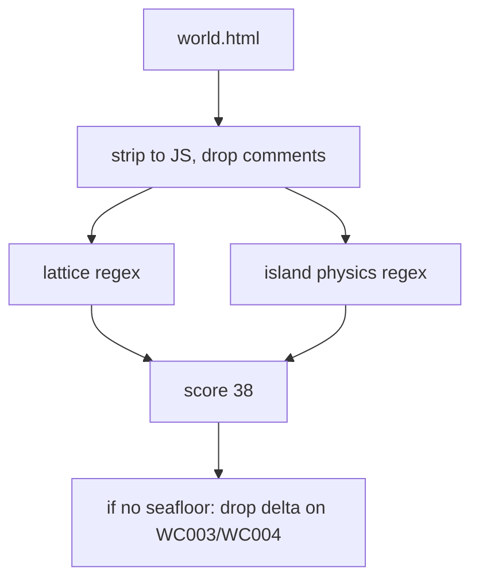

# WC000 Voxel lattice

Is this a cube-grid island in a void, not a heightfield of stretched prisms or a tray of hovering water?



## Flow



1. Strip `world.html` to inline JS (comments out).
2. Regex for lattice shapes: `BoxGeometry`, nested cell loops, a Y-stack of unit cubes, grid snap, one cell size.
3. Regex for island physics: water exists, water is held or falls, still water sits on sand/stone/dirt/bedrock, flora and fauna sit on land.

A held water *sheet* (slab, plane) counts as a barrier for `water_physics`. It does not count as `water_bed`. Still water has to sit on terrestrial solid.

## Scoring

Lattice items are 2 points each (14). Island physics is heavier (24). Max is 38.

| Id | Points | Pass when |
| --- | --- | --- |
| cube_primitive | 2 | Cube primitive, not only spheres/planes |
| bulk_placement | 2 | Nested cell loop or InstancedMesh of boxes |
| discrete_grid | 2 | A cell size, not continuous vertex displacement as the land |
| stacked_columns | 2 | Y-loop of unit cubes, not one stretched prism per cell |
| cube_terrain | 2 | Ground is cubes (the sun may be a plane) |
| grid_aligned | 2 | Cubes snap to the lattice, no dart-throw world coords |
| unit_voxels | 2 | One cell size for land cubes |
| contained_water | 4 | Ocean or river exists |
| water_physics | 6 | Water is held or it falls. It does not hover unsupported |
| water_bed | 10 | Still water sits on solid ground, not only a tray in the void |
| grounded_props | 4 | Props sit on the island mass |

`water_bed` and `water_physics` also gate WC003/WC004: Coastal Delta / Ocean points are dropped if either fails.

## Run

```bash
uv run python -m eval.run fable --test WC000
uv run python tests/WC000_voxel_world/voxel_check.py path/to/world.html [out_dir]
```
