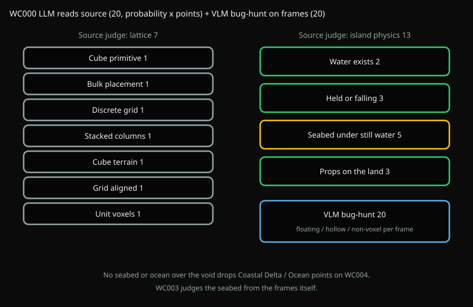
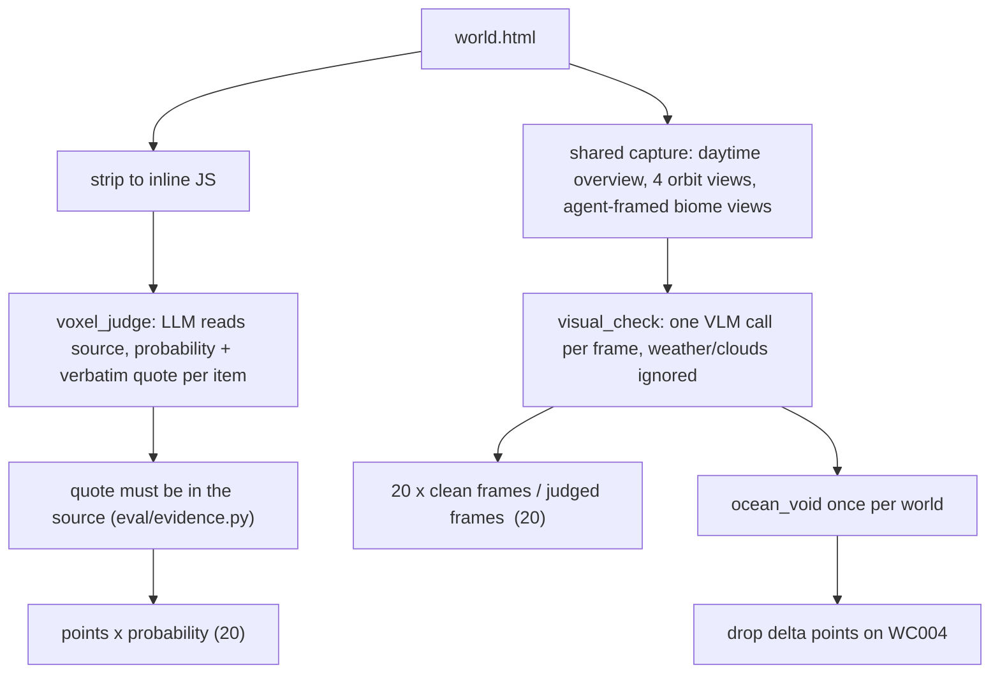

# WC000 Voxel island

Is this a cube-built island in a void, with water that sits on a seabed, and does it look right from every side?



## Flow


```mermaid
flowchart TD
    html["world.html"]
    html --> src["strip to inline JS"]
    src --> judge["voxel_judge: LLM reads source, probability + verbatim quote per item"]
    judge --> verify["quote must be in the source (eval/evidence.py)"]
    verify --> s1["points x probability  (20)"]
    html --> cap["shared capture: daytime overview, 4 orbit views, agent-framed biome views"]
    cap --> hunt["visual_check: one VLM call per frame, weather/clouds ignored"]
    hunt --> s2["20 x clean frames / judged frames  (20)"]
    hunt --> void["ocean_void once per world"]
    void --> w4["drop delta points on WC004"]
```

## Source judge (`voxel_judge.py`, 20)

An LLM reads the stripped JS and returns, per item, a probability and a verbatim quote. Points are `points x probability`, and only when the quote really appears in the source. An invented or stitched-together quote earns nothing.

This replaces a regex check (`voxel_check.py`, removed). 43 of its 83 pattern branches matched exactly one model's file, and consistently renaming variables (which changes nothing about the world) moved scores by up to 14/38.

| Id | Points | Pass when |
| --- | --- | --- |
| cube_primitive | 1 | Terrain is built from cube primitives |
| bulk_placement | 1 | Cubes placed in bulk (cell loops, InstancedMesh, merged buffers) |
| discrete_grid | 1 | Land sits on a cell grid, not a displaced plane |
| stacked_columns | 1 | Columns are stacks of unit cubes, not stretched prisms |
| cube_terrain | 1 | The ground itself is cubes |
| grid_aligned | 1 | Land cubes snap to integer cells |
| unit_voxels | 1 | One cell size for land cubes |
| contained_water | 2 | An ocean or river is built |
| water_physics | 3 | Every water body is supported or visibly falling |
| water_bed | 5 | Still water rests on solid blocks, not a sheet over the void |
| grounded_props | 3 | Props are placed on the island's own cells |

## Visual bug-hunt (`visual_check.py`, 20)

Judges the shared capture frames (see the top-level README): the daytime overview, four orbit directions, and each biome frame the navigator agent saved. One call per frame lists the entities, then hunts:

- `floating_blocks`: a block detached from what should hold it
- `hollow_mass`: a solid-looking volume with holes into the void
- `non_voxel`: smooth or curved terrain instead of chunky cubes
- `water_void`: a water sheet running out over the void with nothing under it

Weather, particles, clouds, mist, the sun and moon, and UI are never defects. On opus-5, most flagged views were clouds called `non_voxel` and falling particles called `floating_blocks`.

A first-pass flag is re-voted twice and kept only on a majority. The score is `20 x clean / judged`, so the maximum doesn't depend on how many frames were captured.

`water_void` is scored once per world, not once per frame. A single ocean sheet shows up in most views: on kimi-k-3 it appeared in 6 of 15, and counting it per frame cost that one defect two thirds of the test. When at least two orbit views agree, it is reported as `ocean_void`.

## Run

```bash
uv run python -m eval.run fable --test WC000
uv run python tests/WC000_voxel_world/voxel_judge.py path/to/world.html [out_dir]
uv run python tests/WC000_voxel_world/visual_check.py outputs/fable/world.html [out_dir]
```
