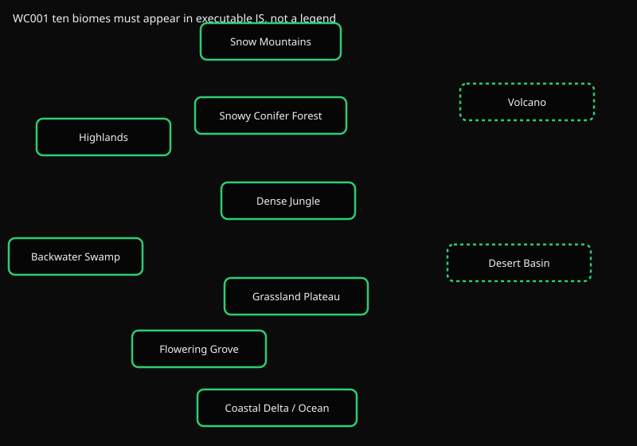
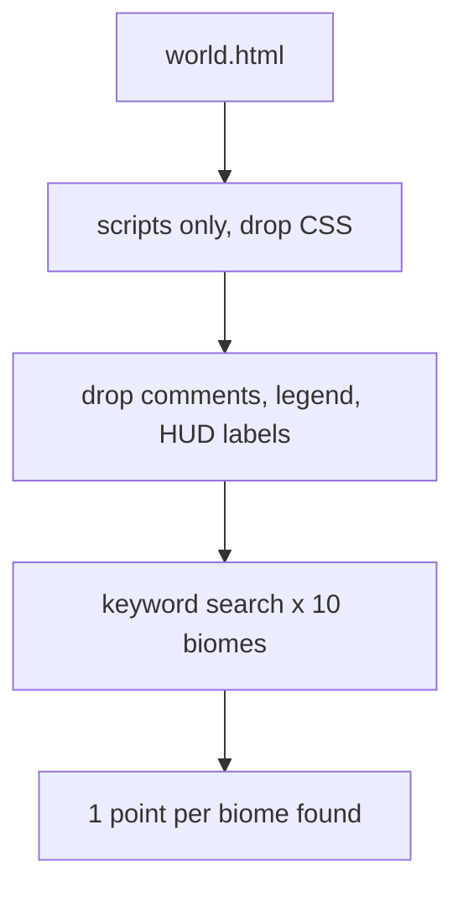

# WC001 Biome coverage

Does the world actually *build* each of the ten canonical biomes? A legend row or a comment does not count.



The graph is the same layout WC002 uses. Here there are no edges. Each node is one biome that must show up in executable JS.

## Flow



1. Read `world.html`, drop CSS, keep `<script>` bodies.
2. Strip block comments, line comments, HUD/legend rows, and `label:` / `innerHTML` strings.
3. For each biome, search the remaining JS for its id or a synonym (`rainforest` for jungle, `taiga` for conifer forest).
4. One point per biome found. Max 10.

## Biomes

| Id | Label | Example synonyms |
| --- | --- | --- |
| mountains | Snow Mountains | peak, alpine |
| forest | Snowy Conifer Forest | pine, spruce, taiga |
| highlands | Highlands | plateau, upland |
| jungle | Dense Jungle | rainforest, canopy |
| swamp | Backwater Swamp | marsh, bog, wetland |
| grove | Flowering Grove | orchard, blossom |
| grassland | Grassland Plateau | prairie, meadow |
| delta | Coastal Delta / Ocean | coast, ocean, estuary |
| desert | Desert Basin | dune, arid |
| volcano | Volcano | lava, magma, caldera |

Presence here is not placement. WC002 checks neighbors and elevation.

## Run

```bash
uv run python -m eval.run fable --test WC001
uv run python tests/WC001_trying_all_the_biomes/biome_check.py path/to/world.html [out_dir]
```
