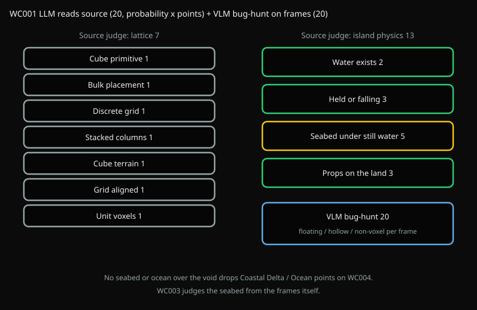
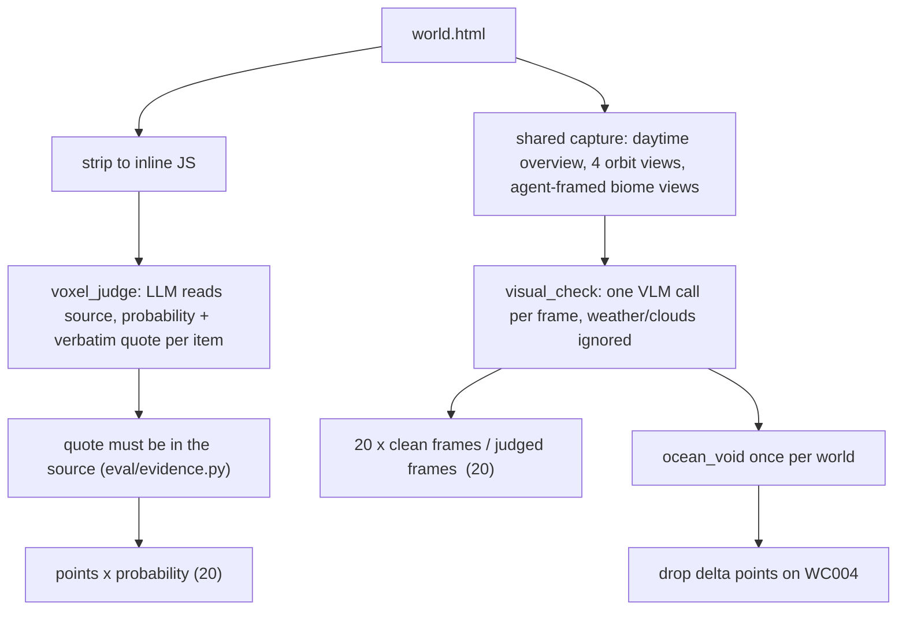

# WC001 Voxel island

Is this a cube-built island in a void, with water that sits on a seabed, and does it look right from every side?



## Flow



## Source judge (`voxel_judge.py`, 20)

An LLM reads the stripped JS and returns, per item, a probability and a verbatim quote. Points are `points x probability`, and only when the quote really appears in the source. An invented or stitched-together quote earns nothing.

This replaces a regex check (`voxel_check.py`, removed). 43 of its 83 pattern branches matched exactly one model's file, and consistently renaming variables (which changes nothing about the world) moved scores by up to 14/38.

| Id | Points | Pass when |
| --- | --- | --- |
| cube_primitive | 1 | Terrain is built from cube primitives |
| bulk_placement | 1 | Cubes placed in bulk (cell loops, InstancedMesh, merged buffers) |
| discrete_grid | 1 | Land sits on a cell grid, not a displaced plane |
| stacked_columns | 1 | Columns are stacks of unit cubes, not stretched prisms |
| cube_terrain | 1 | The ground itself is cubes |
| grid_aligned | 1 | Land cubes snap to integer cells |
| unit_voxels | 1 | One cell size for land cubes |
| contained_water | 2 | An ocean or river is built |
| water_physics | 3 | Every water body is supported or visibly falling |
| water_bed | 5 | Still water rests on solid blocks, not a sheet over the void |
| grounded_props | 3 | Props are placed on the island's own cells |

## Visual bug-hunt (`visual_check.py`, 20)

Judges the shared capture frames (see the top-level README): the daytime overview, four orbit directions, and each biome frame the navigator agent saved. One call per frame lists the entities, then hunts:

- `floating_blocks`: a block detached from what should hold it
- `hollow_mass`: a solid-looking volume with holes into the void
- `non_voxel`: smooth or curved terrain instead of chunky cubes
- `water_void`: a water sheet running out over the void with nothing under it

Weather, particles, clouds, mist, the sun and moon, and UI are never defects. On opus-5, most flagged views were clouds called `non_voxel` and falling particles called `floating_blocks`.

A first-pass flag is re-voted twice and kept only on a majority. The score is `20 x clean / judged`, so the maximum doesn't depend on how many frames were captured.

`water_void` is scored once per world, not once per frame. A single ocean sheet shows up in most views: on kimi-k-3 it appeared in 6 of 15, and counting it per frame cost that one defect two thirds of the test. When at least two orbit views agree, it is reported as `ocean_void`.

## Scoring formulas

WC001 is worth **40** = source judge (20) + visual bug-hunt (20). No logarithms or exponentials are used anywhere; every score is a weighted sum or a ratio, rounded to 2 decimals.

### Quote check (`eval/evidence.py`, shared by every code-evidence test)

Let $\nu(s)$ be $s$ with all whitespace removed and $S = \nu(\text{inline JS})$. A quote $q$ is **verified**, $V(q) = 1$, when any of these holds:

$$
|\nu(q)| \ge 8 \;\wedge\; \Big(\nu(q) \subseteq S \;\;\vee\;\; \text{single line with } \mathrm{pre}(\nu(q)) \ge 0.85\,|\nu(q)| \;\;\vee\;\; \frac{\#\{\ell : \mathrm{match}(\ell)\}}{\#\{\ell : |\nu(\ell)| \ge 8\}} \ge 0.8\Big)
$$

where $\ell$ ranges over the quote's lines with `//` comments stripped, $\mathrm{pre}(x)$ is the length of the longest prefix of $x$ found in $S$, and $\mathrm{match}(\ell) = [\nu(\ell) \subseteq S] \vee [\mathrm{pre}(\nu(\ell)) \ge 0.85\,|\nu(\ell)|]$. The 0.85 prefix rule tolerates a garbled line *tail*; an invented line fails early.

### Source judge (`voxel_judge.py`, max 20)

For each item $i$ with points $w_i$ (table above, $\sum_i w_i = 20$), the judge returns a probability $p_i \in [0,1]$ and a quote $q_i$:

$$
\text{score}_\text{src} = \operatorname{round}\Big(\sum_{i} \operatorname{round}\big(w_i \cdot p_i \cdot V(q_i),\,2\big),\;2\Big)
$$

An item **passes** when $V(q_i) = 1 \wedge p_i \ge 0.5$; otherwise it is listed in `missing` (reported only; the score already carries $p_i$).

### Visual bug-hunt (`visual_check.py`, max 20)

Per frame $f$, defects $D = \{\text{floating\_blocks}, \text{hollow\_mass}, \text{non\_voxel}, \text{water\_void}\}$. The first vote runs at temperature 0; if it flags anything, two more votes run at temperature 0.8, so $n_f \in \{1, 3\}$. A defect $d$ is confirmed when its vote count reaches a strict majority:

$$
\text{confirmed}_f(d) = \Big[\textstyle\sum_{k=1}^{n_f} \text{flag}_k(d) \;\ge\; \lfloor n_f/2 \rfloor + 1\Big]
$$

A frame is **buggy** if it has a confirmed defect among the per-view ones $\{\text{floating\_blocks}, \text{hollow\_mass}, \text{non\_voxel}\}$. With $J$ = frames judged without error and $B$ = buggy frames:

$$
\text{score}_\text{vis} = \operatorname{round}\Big(20 \cdot \frac{|J| - |B|}{|J|},\;2\Big) \qquad (0 \text{ if } |J| = 0)
$$

A frame whose call errored is left out of both $J$ and $B$. `water_void` never makes a frame buggy; instead, over the `overview`/`direction` frames:

$$
\text{ocean\_void} = \Big[\#\{f \in \text{orbit frames} : \text{confirmed}_f(\text{water\_void})\} \ge 2\Big]
$$

`ocean_void` costs nothing here. It is read by WC004's island gate (the delta biome's WC004 points are subtracted, see WC004), and WC003 zeroes its delta biome from its own frames.

## Run

```bash
uv run python -m eval.run fable --test WC001
uv run python tests/WC001_voxel_world/voxel_judge.py path/to/world.html [out_dir]
uv run python tests/WC001_voxel_world/visual_check.py outputs/fable/world.html [out_dir]
```
