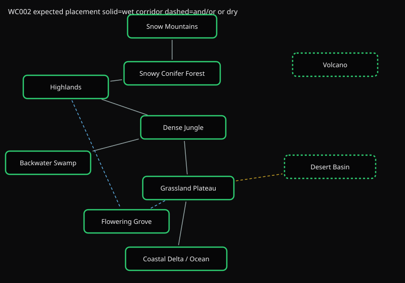
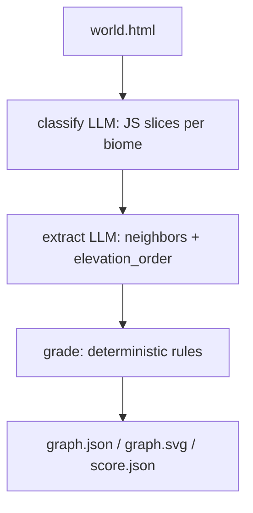
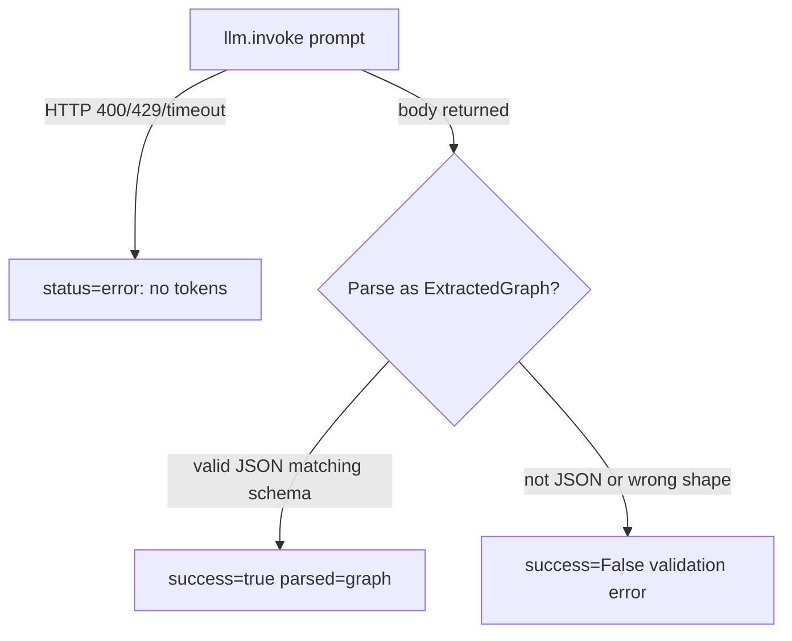

# WC002 Placement graph

The prompt encodes a graph, not a list. Meltwater has to run in one wet corridor from the peaks to the coast. Desert and volcano stay off that corridor.



Solid grey is the required perennial corridor. Dashed blue is the grove's and/or (highland slope *or* plains). Dashed gold is a fading dry wash, related to the plains but never a through-river. Dashed outlines are isolated nodes: desert (arid) and volcano (lava, not water).

At runtime the same layout is written to `graph.json` / `graph.svg` with green = the biome's rules passed, red = failed.

## Flow



Each LLM call is schema-validated:



Grade does not look at the original HTML. It only scores the extracted graph.

## Rules

One point per biome. All of that biome's rules must pass. Max 10.

| Biome | Must connect | Must not connect | Higher than |
| --- | --- | --- | --- |
| mountains | forest | | forest, highlands, jungle, grassland, delta |
| forest | mountains, highlands | | highlands, jungle, grassland, delta |
| highlands | forest, jungle | | jungle, grassland, delta |
| jungle | highlands, grassland, swamp | | grassland, delta |
| swamp | jungle | delta | |
| grove | highlands *or* grassland | | |
| grassland | jungle, delta | | delta |
| delta | grassland | | |
| desert | | mountains, forest, highlands, jungle, delta | |
| volcano | | mountains, forest, highlands, grassland, delta | |

Elevation is the extracted `elevation_order` list: earlier = higher.

## Run

```bash
uv run python -m eval.run fable --test WC002
uv run python tests/WC002_biome_placement/main.py path/to/world.html out_dir
```
