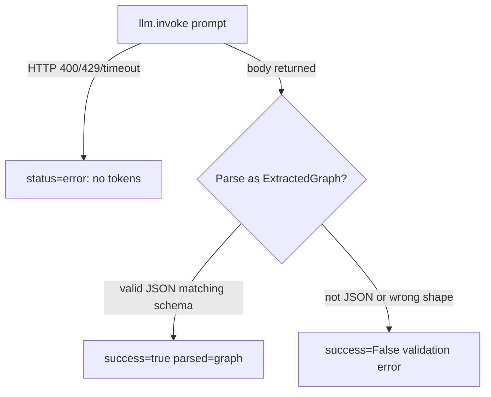

This diagram shows the logical flow of the LLM extraction call and its validation.

```mermaid
flowchart TD
    invoke["llm.invoke prompt"]
    invoke -->|HTTP 400/429/timeout| apiFail["status=error: no tokens"]
    invoke -->|body returned| parse{"Parse as ExtractedGraph?"}
    parse -->|valid JSON matching schema| ok["success=true parsed=graph"]
    parse -->|not JSON or wrong shape| valFail["success=False validation error"]
```
