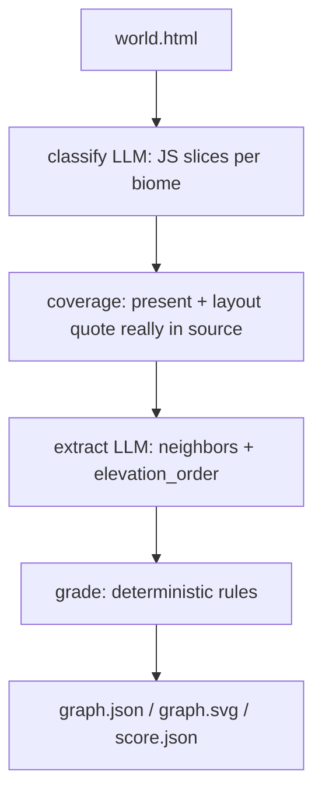
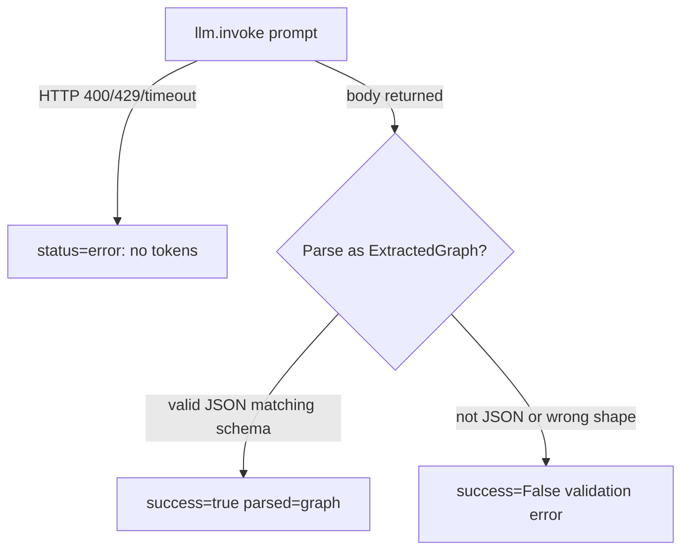

# WC002 Coverage + placement

Is each biome built at all, and does it sit where the prompt's water-flow graph puts it? (The old WC001 biome-coverage test is folded in here.)

The prompt encodes a graph, not a list. Meltwater has to run in one wet corridor from the peaks to the coast. Desert and volcano stay off that corridor.


Solid grey is the required perennial corridor. Dashed blue is the grove's and/or (highland slope *or* plains). Dashed gold is a fading dry wash, related to the plains but never a through-river. Dashed outlines are isolated nodes: desert (arid) and volcano (lava, not water).

At runtime the same layout is written to `graph.json` / `graph.svg` in three states: green = covered and placed right, red = covered but misplaced, grey dashed = not covered.

## Flow


```mermaid
flowchart TD
    html["world.html"]
    html --> classify["classify LLM: JS slices per biome"]
    classify --> coverage["coverage: present + layout quote really in source"]
    coverage --> extract["extract LLM: neighbors + elevation_order"]
    extract --> grade["grade: deterministic rules"]
    grade --> artifacts["graph.json / graph.svg / score.json"]
```

Each LLM call is schema-validated:


```mermaid
flowchart TD
    invoke["llm.invoke prompt"]
    invoke -->|HTTP 400/429/timeout| apiFail["status=error: no tokens"]
    invoke -->|body returned| parse{"Parse as ExtractedGraph?"}
    parse -->|valid JSON matching schema| ok["success=true parsed=graph"]
    parse -->|not JSON or wrong shape| valFail["success=False validation error"]
```

Grade does not look at the original HTML. It only scores the extracted graph.

## Coverage

A biome is covered when the classify step marks it present and the layout code it quotes for that biome really appears in the source (`coverage.py`, `eval/evidence.py`).

The old WC001 searched the JS for biome keywords. Every scored model got 10/10, and a one-line file with no world (`const pine=1,canopy=2,...,lava=9`) also got 10/10.

## Scoring

2 points per biome, max 20:

- 1 point for being covered.
- 1 point if all of its placement rules pass.

An uncovered biome scores 0/2 and is drawn as "not covered". Rules that point at an uncovered biome are skipped rather than failed. That biome already lost its own two points, and failing every neighbour's rule too would charge one absence 4–5 times. An empty graph now scores 0; before this change, desert and volcano passed by default and earned 2.

## Rules

| Biome | Must connect | Must not connect | Higher than |
| --- | --- | --- | --- |
| mountains | forest | | forest, highlands, jungle, grassland, delta |
| forest | mountains, highlands | | highlands, jungle, grassland, delta |
| highlands | forest, jungle | | jungle, grassland, delta |
| jungle | highlands, grassland, swamp | | grassland, delta |
| swamp | jungle | delta | |
| grove | highlands *or* grassland | | |
| grassland | jungle, delta | | delta |
| delta | grassland | | |
| desert | | mountains, forest, highlands, jungle, delta | |
| volcano | | mountains, forest, highlands, grassland, delta | |

Elevation is the extracted `elevation_order` list: earlier = higher.

## Run

```bash
uv run python -m eval.run fable --test WC002
uv run python tests/WC002_biome_placement/main.py path/to/world.html out_dir
```
