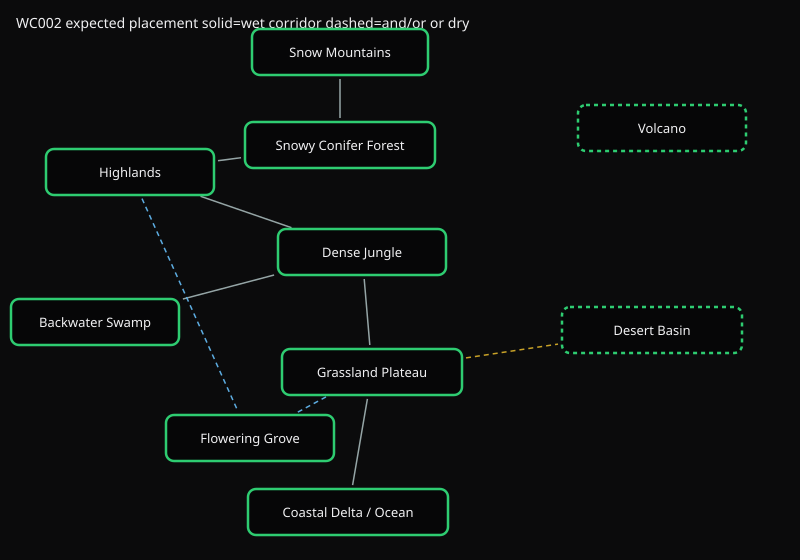
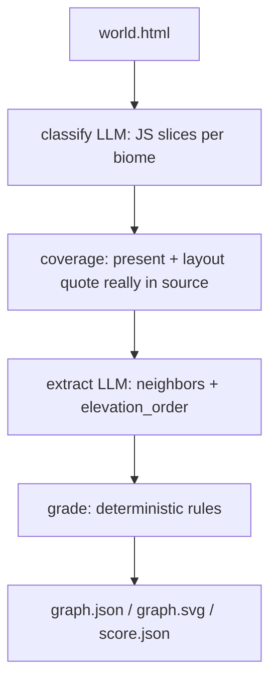
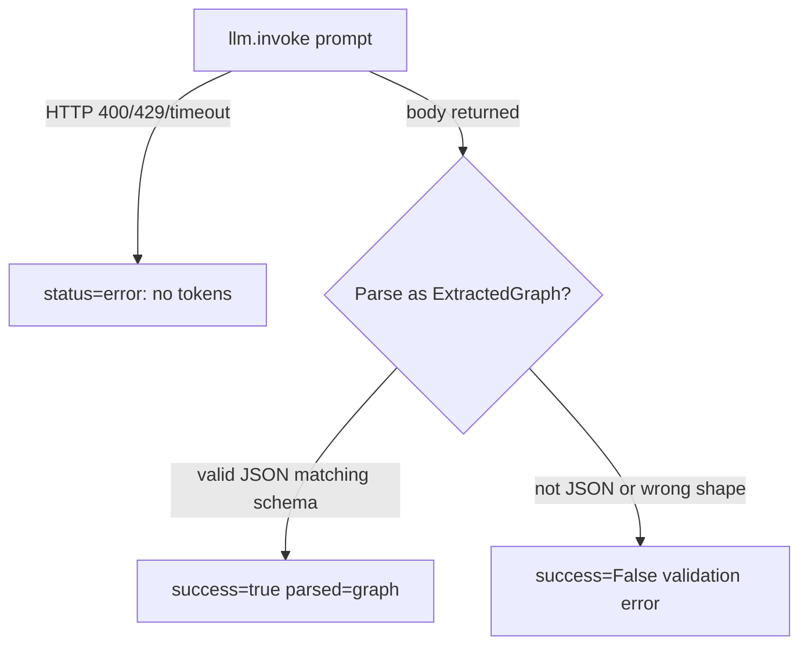

# WC002 Coverage + placement

Is each biome built at all, and does it sit where the prompt's water-flow graph puts it? (The old keyword biome-coverage test is folded in here.)

The prompt encodes a graph, not a list. Meltwater has to run in one wet corridor from the peaks to the coast. Desert and volcano stay off that corridor.



Solid grey is the required perennial corridor. Dashed blue is the grove's and/or (highland slope *or* plains). Dashed gold is a fading dry wash, related to the plains but never a through-river. Dashed outlines are isolated nodes: desert (arid) and volcano (lava, not water).

At runtime the same layout is written to `graph.json` / `graph.svg` in three states: green = covered and placed right, red = covered but misplaced, grey dashed = not covered.

## Flow


```mermaid
flowchart TD
    html["world.html"]
    html --> classify["classify LLM: JS slices per biome"]
    classify --> coverage["coverage: present + layout quote really in source"]
    coverage --> extract["extract LLM: neighbors + elevation_order"]
    extract --> grade["grade: deterministic rules"]
    grade --> artifacts["graph.json / graph.svg / score.json"]
```

Each LLM call is schema-validated:


```mermaid
flowchart TD
    invoke["llm.invoke prompt"]
    invoke -->|HTTP 400/429/timeout| apiFail["status=error: no tokens"]
    invoke -->|body returned| parse{"Parse as ExtractedGraph?"}
    parse -->|valid JSON matching schema| ok["success=true parsed=graph"]
    parse -->|not JSON or wrong shape| valFail["success=False validation error"]
```

Grade does not look at the original HTML. It only scores the extracted graph.

## Coverage

A biome is covered when either source shows it (`coverage.py`):

- **Source:** the classify step marks it present, and the layout code it quotes really appears in the source (`eval/evidence.py`).
- **Frames:** the capture's blind check identified that biome's frame as that biome without being told which it was meant to be.

One classify call used to decide this alone, and it missed opus-5's ocean.

The old keyword-coverage test searched the JS for biome keywords. Every scored model got 10/10, and a one-line file with no world (`const pine=1,canopy=2,...,lava=9`) also got 10/10.

## Scoring

2 points per biome, max 20:

- 1 point for being covered.
- 1 point if all of its placement rules pass.

An uncovered biome scores 0/2 and is drawn as "not covered". Rules that point at an uncovered biome are skipped rather than failed. That biome already lost its own two points, and failing every neighbour's rule too would charge one absence 4–5 times. An empty graph now scores 0; before this change, desert and volcano passed by default and earned 2.

## Rules

| Biome | Must connect | Must not connect | Higher than |
| --- | --- | --- | --- |
| mountains | forest | | forest, highlands, jungle, grassland, delta |
| forest | mountains, highlands | | highlands, jungle, grassland, delta |
| highlands | forest, jungle | | jungle, grassland, delta |
| jungle | highlands, grassland, swamp | | grassland, delta |
| swamp | jungle | delta | |
| grove | highlands *or* grassland | | |
| grassland | jungle, delta | | delta |
| delta | grassland | | |
| desert | | mountains, forest, highlands, jungle, delta | |
| volcano | | mountains, forest, highlands, grassland, delta | |

Elevation is the extracted `elevation_order` list: earlier = higher.

## Scoring formulas

WC002 is worth **20** (10 biomes × 2 points). The arithmetic is counting and set logic, plus one rank comparison. There are no logarithms, exponentials or fractional weights; every per-biome score is 0, 1 or 2.

### Coverage (`coverage.py`)

For biome $b$, with classify block $c_b$ (present flag and the quoted `placement_code` / `elevation_code`) and the capture's blind-identified frames $F$:

$$
\text{src}(b) = \big[c_b.\text{present}\big] \wedge \exists\, q \in \{\text{placement\_code}, \text{elevation\_code}\},\; q \ne \varnothing : V(q) = 1
$$

$$
\text{covered}(b) = \text{src}(b) \vee [\,b \in F\,]
$$

$V(q)$ is the shared quote check (`eval/evidence.py`): the quote, stripped of whitespace, must be in the stripped source, or at least 80% of its lines (each $\ge 8$ characters) must match, where a line matches when at least 85% of it, from its start, is verbatim in the source. The WC000 README has the full form.

### Graph

Only covered biomes can be neighbours. For extracted nodes with neighbour lists, the adjacency is made symmetric:

$$
A = \big\{\{u, v\} : v \in \text{neighbors}(u),\; \text{covered}(u) \wedge \text{covered}(v)\big\}
$$

and $r(b)$ is $b$'s index in `elevation_order` (0 = highest; undefined if $b$ is not listed).

### Placement rules for a covered biome $b$

Each rule list is first filtered to covered biomes; a rule about an uncovered biome is **skipped**, not failed. Then:

| Rule | Passes when |
| --- | --- |
| must_connect $x$ | $\{b, x\} \in A$ |
| must_connect_any $X$ | $\exists\, x \in X : \{b, x\} \in A$ (dropped if $X$ is empty after filtering) |
| must_not_connect $x$ | $\{b, x\} \notin A$ |
| higher_than $x$ | $r(b), r(x)$ both defined $\wedge\; r(b) < r(x)$ |

$$
\text{placed}(b) = \bigwedge_{\text{rules } \rho \text{ of } b} \rho(b)
$$

A biome with no rules left after filtering is placed by default.

### Score

$$
s_b =
\begin{cases}
0 & \neg\,\text{covered}(b) \\
1 + [\,\text{placed}(b)\,] & \text{covered}(b)
\end{cases}
\qquad
\text{score}_\text{WC002} = \sum_{b \in \text{10 biomes}} s_b \;\le\; 20
$$

The test **passes** only when every biome scores 2.

## Run

```bash
uv run python -m eval.run fable --test WC002
uv run python tests/WC002_biome_placement/main.py path/to/world.html out_dir
```
