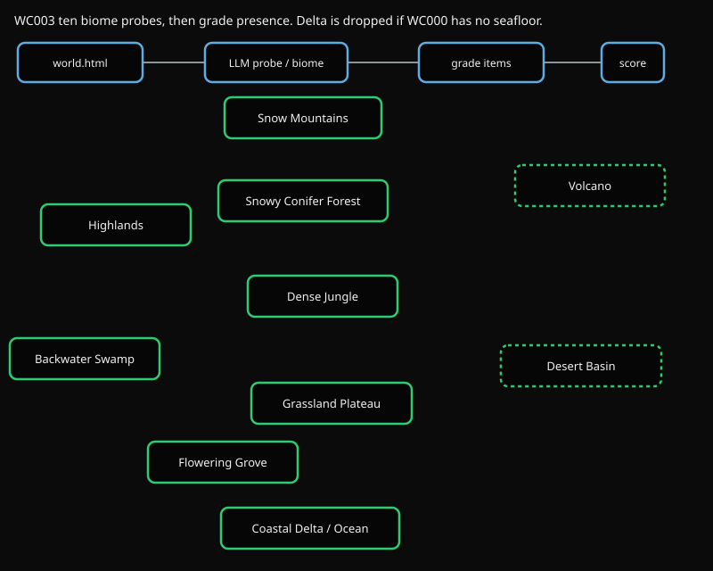
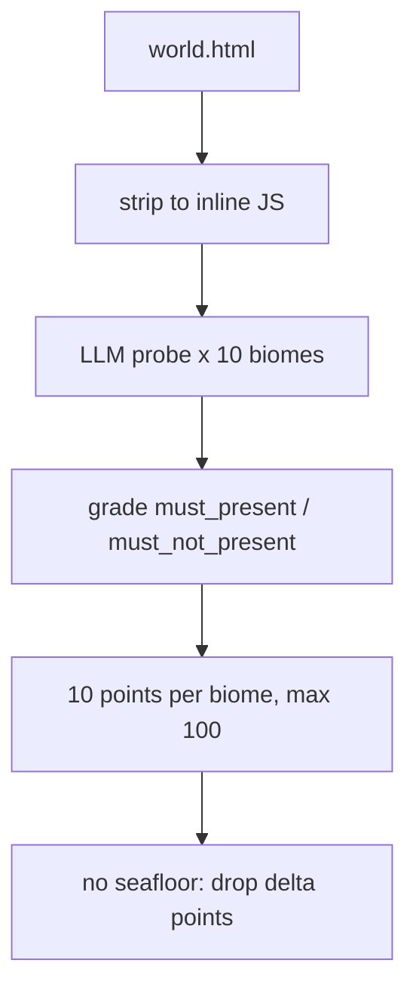

# WC003 Micro-contents

Does each biome contain the things a reasoned island would actually build there: palms on the coast, stilts in the swamp, saguaro in the desert? A biome id in a comment is not enough.



The map is the same ten-biome layout as WC002. The strip on top is the check: one world, one LLM probe per biome, then a deterministic grade.

## Flow



1. Strip `world.html` to inline JS.
2. For each of the ten biomes, send that biome's `prompts/<id>/prompt.md` plus `requirements.json` and the source.
3. The model returns `found` + evidence per `must_present` / `must_not_present` item.
4. Grade rejects comment-only, legend rows, config tables, dart-throw `Math.random()*GRID`, and evidence that does not construct anything.
5. Ten points per biome. Leaks (forbidden stuff present) subtract. Max 100.

If WC000 lost `water_bed` or `water_physics`, the Coastal Delta / Ocean biome's points are removed from this total. Other biomes stay.

Saved probes can be re-scored without new LLM calls:

```bash
uv run python tests/WC003_biome_micro_contents/main.py --regrade path/to/micro_contents.json
uv run python scripts/regrade_probes.py --all
```

## Run

```bash
uv run python -m eval.run fable --test WC003
uv run python tests/WC003_biome_micro_contents/main.py path/to/world.html out_dir
```
