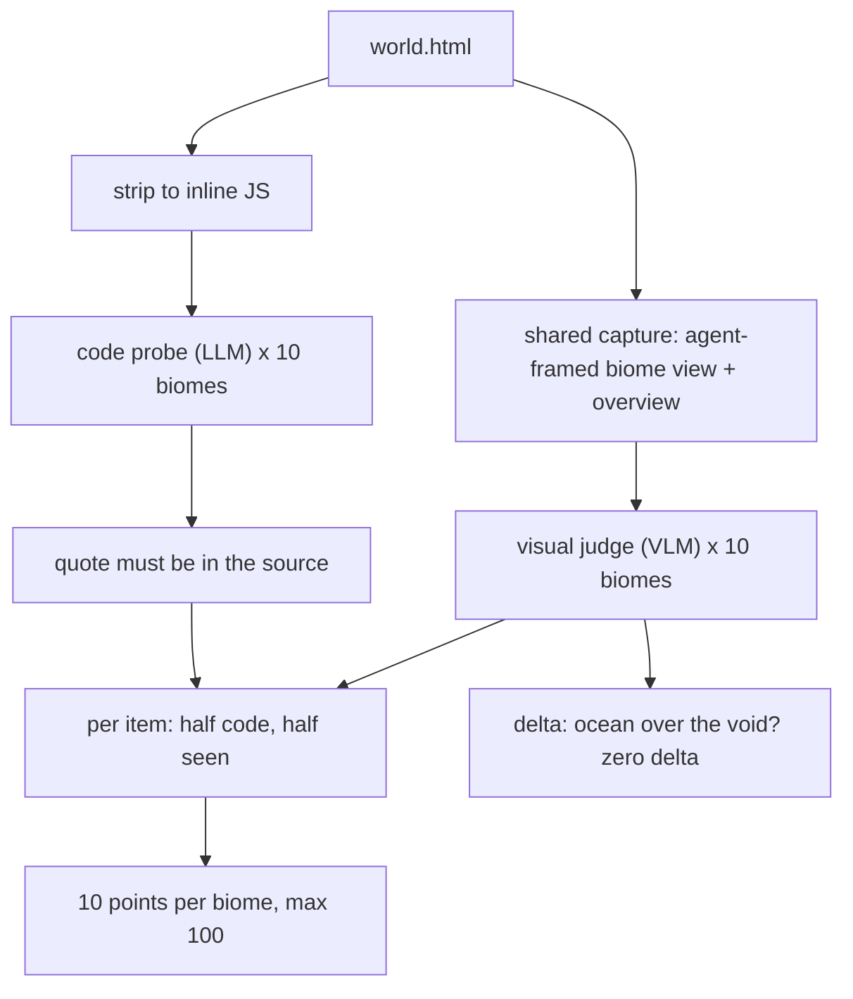

# WC003 Micro-contents

Does each biome contain the things a reasoned island would actually build there: palms on the coast, stilts in the swamp, saguaro in the desert? A biome id in a comment is not enough.


The map is the same ten-biome layout as WC002. The strip on top is the check: one world, one LLM probe per biome, then a deterministic grade.

## Flow


```mermaid
flowchart TD
    html["world.html"]
    html --> strip["strip to inline JS"]
    strip --> probe["code probe (LLM) x 10 biomes"]
    probe --> verify["quote must be in the source"]
    html --> cap["shared capture: agent-framed biome view + overview"]
    cap --> vis["visual judge (VLM) x 10 biomes"]
    verify --> grade["per item: half code, half seen"]
    vis --> grade
    grade --> score["10 points per biome, max 100"]
    vis --> void["delta: ocean over the void? zero delta"]
```

1. The code probe works as before: each biome's `prompts/<id>/prompt.md` plus `requirements.json` is run against the source, and returns `found` plus evidence per `must_present` / `must_not_present` item. Evidence must really appear in the source.
2. The visual judge (`visual.py`, `eval/capture/judge.py`) gets that biome's frame (saved by the navigator agent) and the overview. It confirms the frame shows the biome, then reports which items and leaks it can see.
3. Each item's points are split: half for code that builds it, half for being seen. An item may carry a `weight` in `requirements.json`; the default is 1.
4. A leak found by either the code or the frames subtracts that item's points.
5. A biome with no code evidence that also isn't visible in any frame is absent and scores 0.
6. Delta also gets the underside and side orbit views, plus one question: does the ocean run out over the void with nothing beneath it? If yes, delta scores 0. This replaces the old island gate for this test.

Saved probes and `visual.json` can be re-scored without new model calls:

```bash
uv run python tests/WC003_biome_micro_contents/main.py --regrade path/to/micro_contents.json
uv run python scripts/regrade_probes.py --all
```

## Run

```bash
uv run python -m eval.run fable --test WC003
uv run python tests/WC003_biome_micro_contents/main.py path/to/world.html out_dir
```
