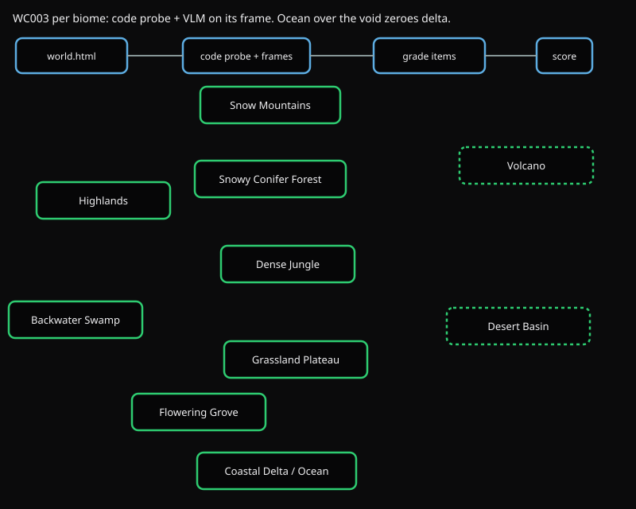
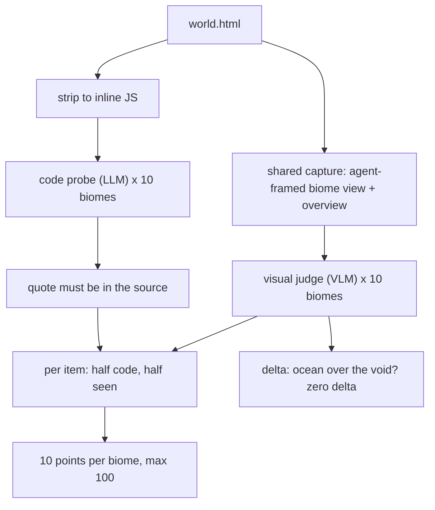

# WC003 Micro-contents

Does each biome contain the things a reasoned island would actually build there: palms on the coast, stilts in the swamp, saguaro in the desert? A biome id in a comment is not enough.



The map is the same ten-biome layout as WC002. The strip on top is the check: one world, one LLM probe per biome, then a deterministic grade.

## Flow


```mermaid
flowchart TD
    html["world.html"]
    html --> strip["strip to inline JS"]
    strip --> probe["code probe (LLM) x 10 biomes"]
    probe --> verify["quote must be in the source"]
    html --> cap["shared capture: agent-framed biome view + overview"]
    cap --> vis["visual judge (VLM) x 10 biomes"]
    verify --> grade["per item: half code, half seen"]
    vis --> grade
    grade --> score["10 points per biome, max 100"]
    vis --> void["delta: ocean over the void? zero delta"]
```

1. The code probe works as before: each biome's `prompts/<id>/prompt.md` plus `requirements.json` is run against the source, and returns `found` plus evidence per `must_present` / `must_not_present` item. Evidence must really appear in the source. Only hints are rejected (comments, bare tokens, lone waypoints, legend/HUD rows). Checks on how the code is written (`config_table`, `no_constructor`, `dart_throw`) were removed: they rejected data-driven worlds such as opus-5's wholesale.
2. The visual judge (`visual.py`, `eval/capture/judge.py`) gets that biome's frame and the overview, and reports which items and leaks it can see. The biome frame is only used if the capture's blind check confirmed it.
3. Each item's points are split: half for code that builds it, half for being seen. An item may carry a `weight` in `requirements.json`; the default is 1.
4. A leak found by either the code or the frames subtracts that item's points.
5. A biome with no code evidence that also isn't visible in any frame is absent and scores 0.
6. Delta also gets the underside and side orbit views, plus one question: does the ocean run out over the void with nothing beneath it? If yes, delta scores 0. This replaces the old island gate for this test.

## Scoring formulas

WC003 is worth **100** (10 biomes × 10 points). All arithmetic is linear: weighted shares, subtractions and a clamp. No logarithms or exponentials. Every per-item value is rounded to 2 decimals, and so is every biome score.

### Before grading (inputs, not score arithmetic)

- **Quote repair** (`eval/quote_repair.py`): a probe quote that isn't in the source, or that contains `...`, is rebuilt from the real source lines it points at, when those lines can be found. The grader never gets more lenient; it just receives a real quote.
- **Recheck** (`recheck.py`): for a `must_present` item the frames show but the code half rejected, one evidence-agent hunt runs. If it returns a verified quote, that quote replaces the probe's.

### Code presence of one item

For an item's probe judgement $j$ (`found`, `evidence`):

$$
P(j) = j.\text{found} \;\wedge\; \neg\,\text{notInScope}(j) \;\wedge\; \neg\,\text{hint}(j.\text{evidence}) \;\wedge\; V(j.\text{evidence})
$$

- $\text{notInScope}$: the evidence says "not in … scope".
- $\text{hint}$: after dropping comments, the evidence is empty, a bare biome token (`BIOMES.x.id`), a lone `{x:…, z:…}` waypoint, or a legend/HUD row (`label:` with `weather:`/`color:` and no world call).
- $V$ is the shared quote check (`eval/evidence.py`; full form in the WC000 README): the whitespace-free quote is in the whitespace-free source, or at least 80% of its lines (each $\ge 8$ chars) match, where a line matches when at least 85% of it, from its start, is verbatim in the source.

### One biome $b$

Items come from `prompts/<b>/requirements.json`. Present items $I$ carry weight $w_i$ (default 1; every current item is 1); leak items are $L$.

$$
u = \frac{10}{\sum_{i \in I} w_i}, \qquad p_i = \operatorname{round}(u \cdot w_i,\,2)
$$

Code and sight each carry half an item, $\alpha_c = \alpha_v = 0.5$. When a run has no visual report (a code-only regrade of an old run), $\alpha_c = 1, \alpha_v = 0$.

$$
g_i = \operatorname{round}\Big(p_i \cdot \big(\alpha_c\,[P(j_i)] + \alpha_v\,[\text{seen}_i]\big),\;2\Big)
$$

where $\text{seen}_i$ is the visual judge's `visible` for item $i$. For each leak $\ell \in L$, the leak counts if the code or the frames show it:

$$
\text{leak}_\ell = P(j_\ell) \vee \text{seen}_\ell, \qquad \text{penalty} = \sum_{\ell \in L} \operatorname{round}(u \cdot w_\ell, 2)\,[\text{leak}_\ell]
$$

$$
s_b = \operatorname{round}\Big(\max\Big(0,\; \sum_{i \in I} g_i \;-\; \text{penalty}\Big),\;2\Big)
$$

Three overrides, in order:

1. **Probe or visual call failed:** $s_b = 0$.
2. **Absent:** no item has $P = 1$, the probe found no source alias for the biome, and the frames neither show it ($\neg$`shows_biome` $\wedge$ $\neg$`biome_visible`). Then $s_b = 0$.
3. **Delta only:** if the visual judge answers `ocean_over_void` (the ocean runs out over the void with nothing beneath), $s_\text{delta} = 0$.

### Test score

$$
\text{score}_\text{WC003} = \operatorname{round}\Big(\sum_{b} s_b,\;2\Big) \le 100
$$

The test **passes** only when no biome has any lost item (no partial credit, no leak).

Saved probes and `visual.json` can be re-scored without new model calls:

```bash
uv run python tests/WC003_biome_micro_contents/main.py --regrade path/to/micro_contents.json
uv run python scripts/regrade_probes.py --all
```

## Run

```bash
uv run python -m eval.run fable --test WC003
uv run python tests/WC003_biome_micro_contents/main.py path/to/world.html out_dir
```
