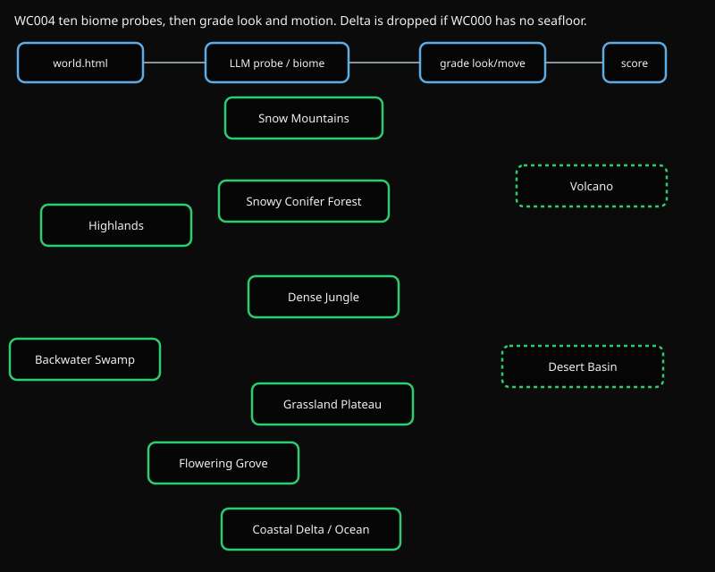
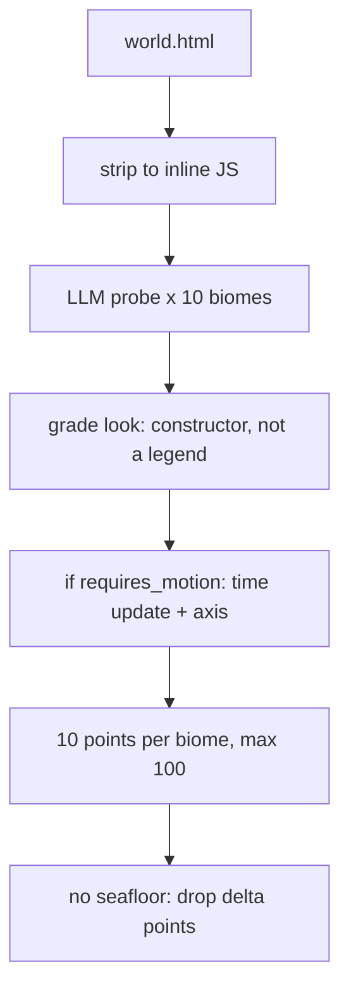

# WC004 Physics

WC003 asks *whether* a thing is there. This test asks whether it *looks* like that thing and *moves* on the right axis: blizzard blows on peaks, sandstorms blow, rain falls, fish swim, lava sits.



Same ten-biome map as WC002. The strip is the check: probe look and motion per biome, then grade.

## Flow



1. Strip `world.html` to inline JS.
2. For each biome, send `prompts/<id>/prompt.md` plus `templates.json` (entities with `looks_like`, `expected_axis`, `requires_motion`).
3. The model returns look evidence, motion evidence, and an axis.
4. Grade requires a real constructor for look. Motion items also need a time update (not spawn-only), a compatible axis, and no duplicate evidence reused across entities.
5. Ten points per biome. Forbidden entities subtract. Max 100.

If WC000 lost `water_bed` or `water_physics`, Coastal Delta / Ocean points are removed from this total.

Axes the grader accepts: falling, blowing, rising, still, flowing, grounded, pulsing, n/a. Close aliases map (down → falling, wind → blowing).

Re-score a saved probe:

```bash
uv run python tests/WC004_biome_rendering/main.py --regrade path/to/rendering.json
```

## Run

```bash
uv run python -m harness.run fable --test WC004
uv run python tests/WC004_biome_rendering/main.py path/to/world.html out_dir
```
