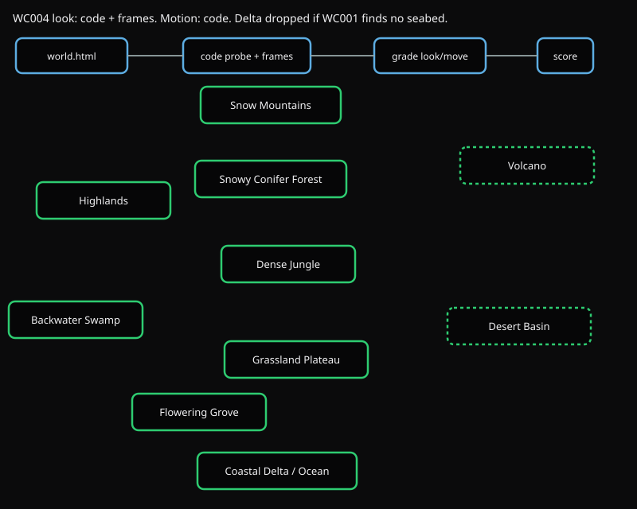
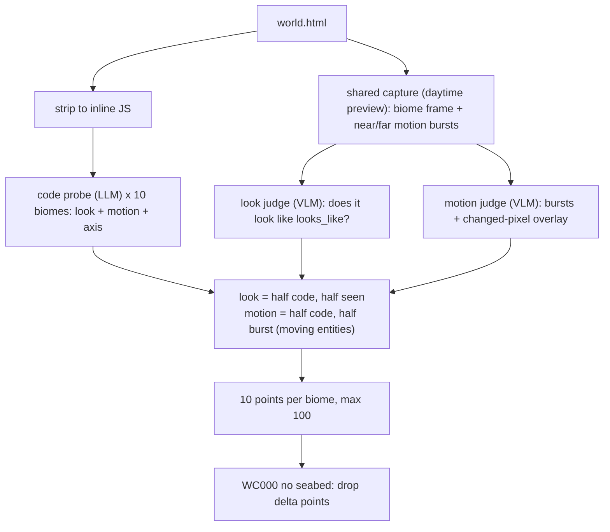

# WC004 Physics

WC003 asks *whether* a thing is there. This test asks whether it *looks* like that thing and *moves* on the right axis: blizzard blows on peaks, sandstorms blow, rain falls, fish swim, lava sits.



Same ten-biome map as WC002. The strip is the check: probe look and motion per biome, then grade.

## Flow


```mermaid
flowchart TD
    html["world.html"]
    html --> strip["strip to inline JS"]
    strip --> probe["code probe (LLM) x 10 biomes: look + motion + axis"]
    html --> cap["shared capture (daytime preview): biome frame + near/far motion bursts"]
    cap --> vis["look judge (VLM): does it look like looks_like?"]
    cap --> mot["motion judge (VLM): bursts + changed-pixel overlay"]
    probe --> grade["look = half code, half seen\nmotion = half code, half burst (moving entities)"]
    vis --> grade
    mot --> grade
    grade --> score["10 points per biome, max 100"]
    score --> gate["WC000 no seabed: drop delta points"]
```

1. The code probe works as before: each biome's `prompts/<id>/prompt.md` plus `templates.json` returns look evidence, motion evidence and an axis. Both quotes must really appear in the source.
2. The visual judge checks each entity against its `looks_like` on the biome's frame and the overview.
3. Motion bursts: after the navigator frames a biome on the daytime preview, capture takes a "near" burst (its framing) and a "far" burst (zoomed out once). Each is a few frames about 2 s apart with the camera still, plus an overlay marking changed pixels in red. Daytime on purpose: at night most moving things can't be seen at all. Kept small on purpose too: no pivots, and no waiting for weather cycles.
4. A still entity's points are split: half for the code's look, half for being seen. A moving entity's points are half look (same split) and half motion. The motion half is split again:
   - Code: a time update on a compatible axis, not spawn-only, not evidence reused from another entity.
   - Burst: the VLM says it moves on a compatible axis in the burst frames, and the burst's pixels really changed (at least 0.1%). For `still` / `grounded` entities (hanging mist, idle fauna), being visible on a compatible axis is enough.
5. Forbidden entities found by either the code or the frames subtract. A biome absent from both scores 0. An entity may carry a `weight`; the default is 1.

If WC000's source judge puts `water_bed` or `water_physics` below 0.5, or its bug-hunt sees `ocean_void`, the Coastal Delta / Ocean points are removed from this total.

Axes the grader accepts: falling, blowing, rising, still, flowing, grounded, pulsing, n/a. Close aliases map (down → falling, wind → blowing).

Re-score a saved probe:

```bash
uv run python tests/WC004_biome_rendering/main.py --regrade path/to/rendering.json
```

## Run

```bash
uv run python -m eval.run fable --test WC004
uv run python tests/WC004_biome_rendering/main.py path/to/world.html out_dir
```
