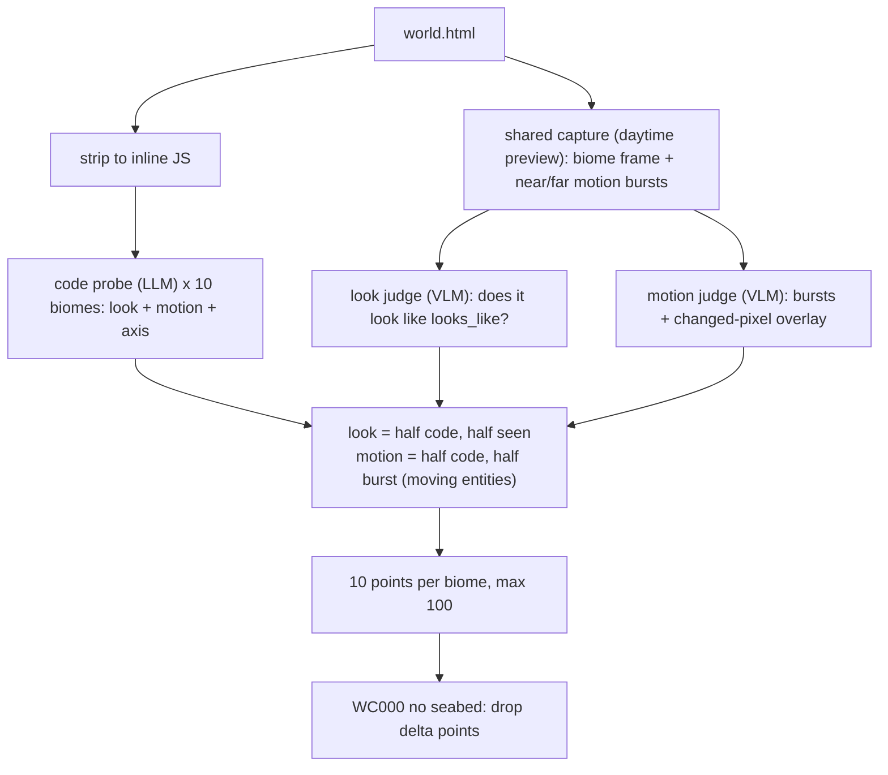

# WC004 Physics

WC003 asks *whether* a thing is there. This test asks whether it *looks* like that thing and *moves* on the right axis: blizzard blows on peaks, sandstorms blow, rain falls, fish swim, lava sits.


Same ten-biome map as WC002. The strip is the check: probe look and motion per biome, then grade.

## Flow


```mermaid
flowchart TD
    html["world.html"]
    html --> strip["strip to inline JS"]
    strip --> probe["code probe (LLM) x 10 biomes: look + motion + axis"]
    html --> cap["shared capture (daytime preview): biome frame + near/far motion bursts"]
    cap --> vis["look judge (VLM): does it look like looks_like?"]
    cap --> mot["motion judge (VLM): bursts + changed-pixel overlay"]
    probe --> grade["look = half code, half seen\nmotion = half code, half burst (moving entities)"]
    vis --> grade
    mot --> grade
    grade --> score["10 points per biome, max 100"]
    score --> gate["WC000 no seabed: drop delta points"]
```

1. The code probe works as before: each biome's `prompts/<id>/prompt.md` plus `templates.json` returns look evidence, motion evidence and an axis. Both quotes must really appear in the source.
2. One visual call per biome checks each entity against its `looks_like` on the blind-confirmed biome frame and the overview, and judges motion from the bursts in the same call.
3. Motion bursts: after the navigator frames a biome on the daytime preview, capture takes a "near" burst (its framing) and a "far" burst (zoomed out once). Each is a few frames about 2 s apart with the camera still, plus an overlay marking changed pixels in red. Daytime on purpose: at night most moving things can't be seen at all. Kept small on purpose too: no pivots, and no waiting for weather cycles.
4. A still entity's points are split: half for the code's look, half for being seen. A moving entity's points are half look (same split) and half motion. The motion half is split again:
   - Code: a time update on a compatible axis, not spawn-only, not evidence reused from another entity.
   - Burst: the VLM says it moves on a compatible axis in the burst frames, and the burst's pixels really changed (at least 0.1%). For `still` entities (hanging mist), being visible on a compatible axis is enough.
   - Fauna and other small movers are scored on code motion alone. They were "not visible" in most bursts, and the VLM also invented motion for them. Only weather, water and terrain (lava, glow) get a motion verdict from frames.
5. Forbidden entities found by either the code or the frames subtract. A biome absent from both scores 0. An entity may carry a `weight`; the default is 1.

If WC000's bug-hunt sees `ocean_void`, the Coastal Delta / Ocean points are removed from this total.

Axes the grader accepts: falling, blowing, rising, still, flowing, grounded, pulsing, n/a. Close aliases map (down → falling, wind → blowing).

## Scoring formulas

WC004 is worth **100** (10 biomes × 10 points). The arithmetic is linear: nested shares, subtractions, a clamp, and one pixel-count ratio for motion. No logarithms or exponentials. Per-entity values and biome scores are rounded to 2 decimals.

### Shared pieces

- $V(q)$ is the quote check (`eval/evidence.py`; full form in the WC000 README). The whitespace-free quote must be in the whitespace-free source, or at least 80% of its lines (each $\ge 8$ chars) must match, where a line matches when at least 85% of it, from its start, is verbatim in the source.
- $\text{hint}(q)$: after dropping comments, the quote is empty, a bare biome token, a lone `{x, z}` waypoint, or a legend/HUD row.
- **Axis compatibility** $\text{ax}(e, r)$, for expected $e$ and reported $r$, after aliasing (`down`/`fall`/`drift`→falling, `wind`/`sideways`→blowing, `up`→rising, `glow`/`pulse`→pulsing, `hang`→still, `walk`/`idle`→grounded, `static`/`none`→n/a):

  $$\text{ax}(e,r) = [e = r] \vee [e \in \{\text{n/a}, \text{still}\} \wedge r \in \{\text{n/a}, \text{still}, \varnothing\}] \vee [e{=}\text{falling} \wedge r{=}\text{flowing}] \vee [e{=}\text{flowing} \wedge r \in \{\text{falling}, \text{pulsing}\}] \vee [e{=}\text{rising} \wedge r{=}\text{pulsing}]$$

- **Duplicate evidence:** a quote's key is $\text{sha256}(\text{collapse-whitespace}(\text{code-only}(q)))_{[:16]}$. A quote whose key an earlier entity in the same biome already used doesn't count again.

### Code verdicts for entity $x$

From the probe's `looks_ok`, `moves_ok`, `axis`, `look_evidence` $q_L$ and `motion_evidence` $q_M$:

$$
C_L(x) = \neg\text{notInScope}(q_L) \wedge \text{looks\_ok} \wedge \neg\text{hint}(q_L) \wedge V(q_L) \wedge \big(\text{moving}(x) \vee \text{axis}{=}\varnothing \vee \text{ax}(e_x, \text{axis})\big) \wedge \text{unused}(q_L)
$$

$$
C_M(x) = \text{moves\_ok} \wedge q_M \ne \varnothing \wedge q_M \ne q_L \wedge \neg\text{hint}(q_M) \wedge V(q_M) \wedge \text{timeUpdate}(q_M) \wedge \text{ax}(e_x, \text{axis}) \wedge \text{unused}(q_M)
$$

$\text{timeUpdate}$ is a regex hit for a time or frame driver (`dt`, `delta`, `clock.getDelta`, `time`, `now`, `requestAnimationFrame`, `animate`, `forEach(`, `position.x|y|z +=`, `attributes.position`, `pos[...] +=`, `velocit…`, `instanceMatrix.needsUpdate`, …). $C_M$ applies only to entities with `requires_motion`.

### Motion from the bursts

Each burst is a set of frames about 2 s apart with the camera still: "near" uses 4 frames, "far" 3. With grey level $Y = 0.299R + 0.587G + 0.114B$ (PIL `L`), a pixel changed if it moved by more than 24 grey levels between any two consecutive frames:

$$
M(p) = \bigvee_{t} \big[\,|Y_t(p) - Y_{t+1}(p)| > 24\,\big], \qquad \phi = \operatorname{round}\Big(\frac{\#\{p : M(p)\}}{\#\{p\}},\;5\Big)
$$

The visual motion verdict for entity $x$, from the motion judge's sighting (`moving`, `axis`, `seen`):

$$
V_M(x) = \text{visible}_x \wedge \text{ax}(e_x, \text{axis}_\text{seen}) \wedge \Big(e_x \in \{\text{still}, \text{n/a}, \text{grounded}\} \;\vee\; \big(\text{moving} \wedge \max(\phi_\text{near}, \phi_\text{far}) \ge 0.001\big)\Big)
$$

Here $\text{visible}_x$ is false when the judge's `seen` says "not visible".

### Credit and biome score

Weights $w_x$ come from `templates.json` (default 1; every current entity is 1):

$$
u = \frac{10}{\sum_x w_x}, \qquad p_x = \operatorname{round}(u\, w_x,\,2)
$$

$$
\text{look}_x = \lambda_c\,[C_L(x)] + \lambda_v\,[\text{seen}_x], \qquad \lambda_c = \lambda_v = 0.5 \;\;(\text{no visual report: } 1, 0)
$$

$$
\text{credit}_x =
\begin{cases}
\text{look}_x & \text{entity doesn't move} \\[2pt]
0.5\,\text{look}_x + 0.5\,\big(\mu_c\,[C_M(x)] + \mu_v\,[V_M(x)]\big) & \text{moving, kind} \in \{\text{weather}, \text{water}, \text{terrain}\} \\[2pt]
0.5\,\text{look}_x + 0.5\,[C_M(x)] & \text{moving, other kinds (e.g. fauna)}
\end{cases}
$$

with $\mu_c = \mu_v = 0.5$ (no motion report: $1, 0$). Then:

$$
g_x = \operatorname{round}(p_x \cdot \text{credit}_x,\;2), \qquad
s_b = \operatorname{round}\Big(\max\Big(0,\; \sum_x g_x - \sum_{\ell \in L} \operatorname{round}(u\,w_\ell,2)\,[\text{leak}_\ell]\Big),\;2\Big)
$$

A leak $\ell$ counts when the code proves it (found, in scope, not a hint, $V$) or the frames show it.

Overrides: if the probe or visual call failed, $s_b = 0$. If no entity has $C_L = 1$, the probe found no source alias, and the frames don't show the biome, then $s_b = 0$.

### Test score and the island gate

$$
\text{score}_\text{WC004} = \sum_b s_b \;-\; [\,\text{ocean\_void}\,] \cdot s_\text{delta} \;\ge\; 0
$$

`ocean_void` comes from WC000's bug-hunt: at least 2 orbit frames show water running out over the void. When the gate fires, `eval/score.py` subtracts the delta biome's WC004 points and marks the test not passed. The test **passes** only when no biome has a lost row.

Re-score a saved probe:

```bash
uv run python tests/WC004_biome_rendering/main.py --regrade path/to/rendering.json
```

## Run

```bash
uv run python -m eval.run fable --test WC004
uv run python tests/WC004_biome_rendering/main.py path/to/world.html out_dir
```
