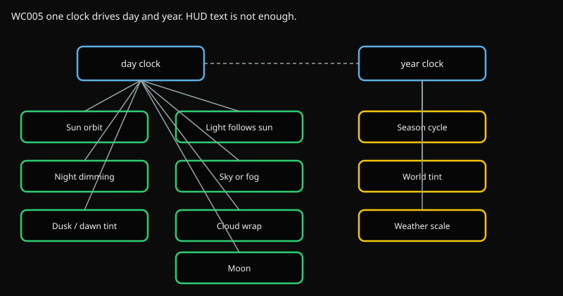
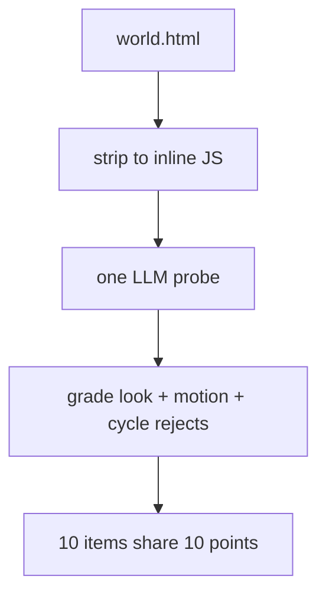

# WC005 Temporal cycles

A void island still has a day and a year. The sun has to move, night has to darken the scene, seasons have to tint the world. A HUD clock with no lighting change fails.



Day items (green) hang off the day clock. Season items (gold) hang off the year clock. Both are one probe, then a deterministic grade.

## Flow



1. Strip `world.html` to inline JS.
2. One LLM probe against `prompts/templates.json`.
3. Grade look and motion the same way WC004 does, plus cycle-specific rejects: HUD-only season text, starfields, atmosphere domes.
4. Ten items share 10 points. Stars / sky dome is a leak. Max 10.

## Items

| Id | Clock | Needs motion |
| --- | --- | --- |
| sun_orbit | day | yes |
| light_follows_sun | day | yes |
| night_dimming | day | yes |
| dusk_dawn_tint | day | yes |
| sky_or_fog_day_cycle | day | yes |
| cloud_drift_wrap | day | yes |
| moon | day | yes (reasoned extra, not in the generation prompt) |
| season_cycle | year | yes |
| season_world_tint | year | yes |
| season_modulates_weather | year | yes |

Banned: stars, starfield, sky dome. The void stays black.

## Run

```bash
uv run python -m eval.run fable --test WC005
uv run python tests/WC005_day_night_seasons/main.py path/to/world.html out_dir
uv run python tests/WC005_day_night_seasons/main.py --regrade path/to/cycle.json
```
