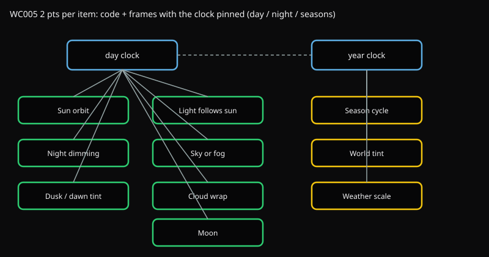
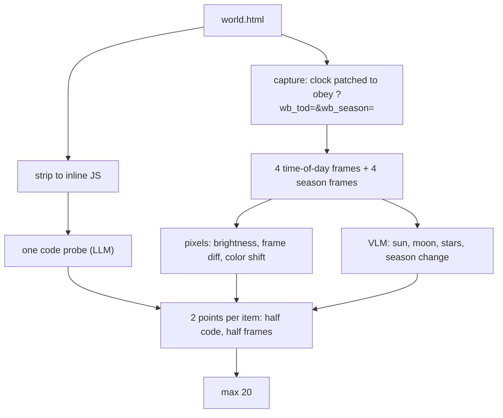

# WC005 Temporal cycles

A void island still has a day and a year. The sun has to move, night has to darken the scene, seasons have to tint the world. A HUD clock with no lighting change fails.



Day items (green) hang off the day clock. Season items (gold) hang off the year clock. Both are one probe, then a deterministic grade.

## Flow


```mermaid
flowchart TD
    html["world.html"]
    html --> strip["strip to inline JS"]
    strip --> probe["one code probe (LLM)"]
    html --> prev["capture: clock patched to obey ?wb_tod=&wb_season="]
    prev --> frames["4 time-of-day frames + 4 season frames"]
    frames --> px["pixels: brightness, frame diff, color shift"]
    frames --> vlm["VLM: sun, moon, stars, season change"]
    probe --> grade["2 points per item: half code, half frames"]
    px --> grade
    vlm --> grade
    grade --> score["max 20"]
```

1. The code probe works as before: one LLM call against `prompts/templates.json`, graded for look and motion plus cycle-specific rejects (HUD-only season text, starfields, atmosphere domes). Quotes must really appear in the source.
2. The shared capture patches the world's own clock so time can be pinned from the URL, then renders four time-of-day frames. The brightest is taken as day and the darkest as night. If the world has seasons, it also renders four season frames at day.
3. "Does X change?" is measured from pixels, not asked. On kimi-k-3 the VLM called the lighting "identical" across frames whose brightness was 11.9 / 35.0 / 11.6 / 11.5.
   - `night_dimming`: the night frame is darker than day.
   - `light_follows_sun`: some time frame differs visibly from day.
   - `dusk_dawn_tint`: a twilight frame's colour shifts.
   - `season_world_tint`: a season frame's colour shifts.
4. Object questions go to the VLM: fog, a visibly changing season, and stars or a sky dome (a leak).
5. `cloud_drift_wrap` and `season_modulates_weather` can't be seen in still frames, so they score on code alone. So do `sun_orbit` and `moon`: the default camera never framed the sun or moon on any model. If the clock patch failed, every item scores on code alone.

The pixel thresholds were calibrated on one world so far. Re-check them on more worlds before trusting small margins.

## Items

| Id | Clock | Needs motion |
| --- | --- | --- |
| sun_orbit | day | yes |
| light_follows_sun | day | yes |
| night_dimming | day | yes |
| dusk_dawn_tint | day | yes |
| sky_or_fog_day_cycle | day | yes |
| cloud_drift_wrap | day | yes |
| moon | day | yes (reasoned extra, not in the generation prompt) |
| season_cycle | year | yes |
| season_world_tint | year | yes |
| season_modulates_weather | year | yes |

Banned: stars, starfield, sky dome. The void stays black.

## Run

```bash
uv run python -m eval.run fable --test WC005
uv run python tests/WC005_day_night_seasons/main.py path/to/world.html out_dir
uv run python tests/WC005_day_night_seasons/main.py --regrade path/to/cycle.json
```
