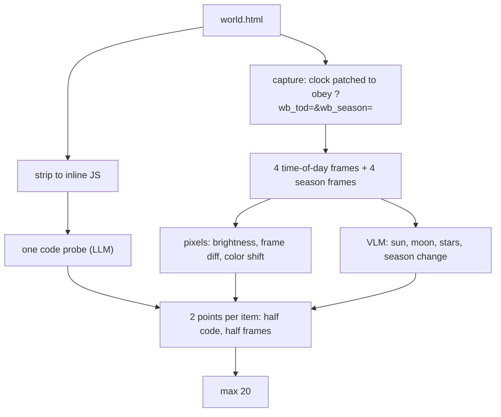

# WC005 Temporal cycles

A void island still has a day and a year. The sun has to move, night has to darken the scene, seasons have to tint the world. A HUD clock with no lighting change fails.


Day items (green) hang off the day clock. Season items (gold) hang off the year clock. Both are one probe, then a deterministic grade.

## Flow


```mermaid
flowchart TD
    html["world.html"]
    html --> strip["strip to inline JS"]
    strip --> probe["one code probe (LLM)"]
    html --> prev["capture: clock patched to obey ?wb_tod=&wb_season="]
    prev --> frames["4 time-of-day frames + 4 season frames"]
    frames --> px["pixels: brightness, frame diff, color shift"]
    frames --> vlm["VLM: sun, moon, stars, season change"]
    probe --> grade["2 points per item: half code, half frames"]
    px --> grade
    vlm --> grade
    grade --> score["max 20"]
```

1. The code probe works as before: one LLM call against `prompts/templates.json`, graded for look and motion plus cycle-specific rejects (HUD-only season text, starfields, atmosphere domes). Quotes must really appear in the source.
2. The shared capture patches the world's own clock so time can be pinned from the URL, then renders four time-of-day frames. The brightest is taken as day and the darkest as night. If the world has seasons, it also renders four season frames at day.
3. "Does X change?" is measured from pixels, not asked. On kimi-k-3 the VLM called the lighting "identical" across frames whose brightness was 11.9 / 35.0 / 11.6 / 11.5.
   - `night_dimming`: the night frame is darker than day.
   - `light_follows_sun`: some time frame differs visibly from day.
   - `dusk_dawn_tint`: a twilight frame's colour shifts.
   - `season_world_tint`: a season frame's colour shifts.
4. Object questions go to the VLM: fog, a visibly changing season, and stars or a sky dome (a leak).
5. `cloud_drift_wrap` and `season_modulates_weather` can't be seen in still frames, so they score on code alone. So do `sun_orbit` and `moon`: the default camera never framed the sun or moon on any model. If the clock patch failed, every item scores on code alone.

The pixel thresholds were calibrated on one world so far. Re-check them on more worlds before trusting small margins.

## Items

| Id | Clock | Needs motion |
| --- | --- | --- |
| sun_orbit | day | yes |
| light_follows_sun | day | yes |
| night_dimming | day | yes |
| dusk_dawn_tint | day | yes |
| sky_or_fog_day_cycle | day | yes |
| cloud_drift_wrap | day | yes |
| moon | day | yes (reasoned extra, not in the generation prompt) |
| season_cycle | year | yes |
| season_world_tint | year | yes |
| season_modulates_weather | year | yes |

Banned: stars, starfield, sky dome. The void stays black.

## Scoring formulas

WC005 is worth **20**: 10 items × 2 points, one pool for the whole world, not per biome. The arithmetic is linear shares, a subtraction and a clamp, plus pixel means and ratios compared to fixed thresholds. No logarithms or exponentials. Per-item values and the total are rounded to 2 decimals.

### Code verdict $C(x)$ for item $x$

From the probe's `looks_ok`, `moves_ok`, `axis`, `look_evidence` $q_L$ and `motion_evidence` $q_M$ (every item has `requires_motion`):

$$
C(x) = \neg\text{notInScope}(q_L) \wedge \text{looks\_ok} \wedge \neg\text{hint}(q_L) \wedge V(q_L) \wedge V(q_M) \wedge \text{moon}(x) \wedge \text{moves\_ok} \wedge q_M \ne \varnothing \wedge q_M \ne q_L \wedge \neg\text{hint}(q_M) \wedge \text{timeUpdate}(q_M) \wedge \text{ax}(e_x, \text{axis}) \wedge \text{unused}(q_L, q_M)
$$

- $V$ is the shared quote check (`eval/evidence.py`; full form in the WC000 README).
- $\text{hint}$ rejects a comment-only quote, a bare token, a lone waypoint, or a legend/HUD row.
- $\text{timeUpdate}$ is a regex hit for a clock driver (`dt`, `delta`, `time`, `now`, `requestAnimationFrame`, `DAY_LEN`, `SEASON_LEN`, `seasonProgress`, `% 4`, `.intensity =`, `.position.set(`, `.visible =`, …).
- $\text{ax}$ is axis compatibility, as in WC004.
- $\text{unused}$ means neither quote's hash (sha256 of the comment-stripped, whitespace-collapsed code) was already used by an earlier item.
- $\text{moon}(x)$ applies only to `moon`: the look quote must reference a moon (`moon`, `moonMesh`, `createMoon`, …) and must not be only stars or a dome. For every other item it is true.

### Visual verdict $S(x)$: measured from pixels

Frames are cropped to the right 80% (legends sit in the left fifth). The capture pins time of day at $t \in \{0, 0.25, 0.5, 0.75\}$ and computes, for each frame, the mean grey level of its **lit** pixels:

$$
\bar Y(f) = \operatorname{mean}\{\,Y(p) : Y(p) > 12\,\} \quad \text{(frame resized to } 320 \times 250\text{)}, \qquad \text{day} = \arg\max_t \bar Y, \quad \text{night} = \arg\min_t \bar Y
$$

Frame difference (mean absolute difference, averaged over the R, G, B channels) and land chromaticity (share of red and of blue among pixels with $R+G+B > 30$, frame resized to $256 \times 200$):

$$
\Delta(a, b) = \frac{1}{3} \sum_{c \in \{R,G,B\}} \operatorname{mean}_p |a_c(p) - b_c(p)|, \qquad
\kappa(f) = \Big(\frac{\sum R}{\sum (R{+}G{+}B)},\; \frac{\sum B}{\sum (R{+}G{+}B)}\Big)
$$

$$
\text{shift}(\kappa_1, \kappa_2) = \max\big(|r_1 - r_2|,\; |b_1 - b_2|\big)
$$

| Item | $S(x)$ |
| --- | --- |
| night_dimming | $\bar Y(\text{day}) - \bar Y(\text{night}) \ge 4.0$ (the clock is really pinned) |
| light_follows_sun | $\exists\, t \ne \text{day}: \Delta(\text{day}, t) \ge 8.0$ |
| dusk_dawn_tint | $\exists\, t \notin \{\text{day}, \text{night}\}: \text{shift}(\kappa(\text{day}), \kappa(t)) \ge 0.03$ |
| season_world_tint | with $\ge 2$ season frames: $\exists\, s: \text{shift}(\kappa(s_1), \kappa(s)) \ge 0.015$; otherwise false |
| sky_or_fog_day_cycle | VLM yes/no: fog or haze changes between times of day |
| season_cycle | VLM yes/no: the season visibly changes (false when there are no season frames) |
| sun_orbit, moon, cloud_drift_wrap, season_modulates_weather | none (code only) |

If the clock patch failed, there are no usable frames and every item is code only.

### Score

With $u = 20 / \sum_x w_x = 2$ (all weights are 1) and $p_x = \operatorname{round}(u\, w_x, 2) = 2$:

$$
\text{credit}_x =
\begin{cases}
[C(x)] & S(x) \text{ undefined (code-only item, or no frames)} \\
0.5\,[C(x)] + 0.5\,[S(x)] & \text{otherwise}
\end{cases}
\qquad g_x = \operatorname{round}(p_x \cdot \text{credit}_x,\,2)
$$

The single leak item `stars_or_atmosphere_dome` counts when the code proves it (found, in scope, not a hint, $V$, and the quote builds stars or a dome rather than weather points) or the VLM sees stars or a dome in any frame:

$$
\text{score}_\text{WC005} = \operatorname{round}\Big(\max\Big(0,\; \sum_x g_x - 2\,[\text{leak}]\Big),\;2\Big) \le 20
$$

A failed probe scores 0. The test **passes** only when every item earns its full 2 points and there is no leak. The pixel thresholds (4.0, 8.0, 0.03, 0.015, and the void and colour cutoffs 12 and 30) were calibrated on a single world so far.

## Run

```bash
uv run python -m eval.run fable --test WC005
uv run python tests/WC005_day_night_seasons/main.py path/to/world.html out_dir
uv run python tests/WC005_day_night_seasons/main.py --regrade path/to/cycle.json
```
